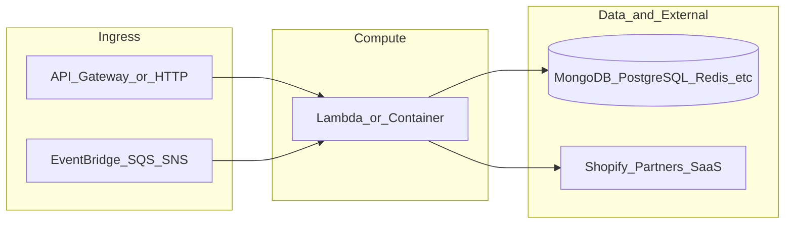

# yofi-lambda-ml-controller

**Path:** `D:/botnot/yofi-lambda-ml-controller`  
**Category:** ml-bot-detection  
**Primary language:** Python  
**Status:** present on disk

## 1. Purpose (2-3 lines)

""" Yofi-lambda-ml-controller """

## 2. Tech stack (from manifests and file-type mix)

- **Detected primary language:** Python
- **Top-level layout:** see listing below.

### `README.md`

```
""" Yofi-lambda-ml-controller """
```

### `readme.md`

```
""" Yofi-lambda-ml-controller """
```

### `Readme.md`

```
""" Yofi-lambda-ml-controller """
```

### `package.json`

```
{
  "engines": {
    "node": ">=18.0.0",
    "npm": "9.5.0"
  },
  "name": "yofi-lambda-ml-controller",
  "version": "1.4.2",
  "private": true,
  "scripts": {
    "test": "sst test",
    "start": "sst start",
    "build": "sst build",
    "deploy": "sst deploy",
    "remove": "sst remove"
  },
  "eslintConfig": {
    "extends": [
      "serverless-stack"
    ]
  },
  "dependencies": {
    "@tsconfig/node16": "1.0.3",
    "typescript": "^4.8.4",
    "sst": "2.41.4",
    "constructs": "10.3.0",
    "@aws-cdk/aws-lambda-python-alpha": "2.132.1-alpha.0",
    "aws-cdk-lib": "2.132.1",
    "ts-node": "^10.9.1",
    "async": ">=2.6.4",
    "jszip": ">=3.7.0"
  }
}
```

### `sst.config.ts`

```
import type {SSTConfig} from "sst"
import {Tracing} from 'aws-cdk-lib/aws-lambda';

// @ts-ignore
import {ExportServiceStack} from "./stacks/ManagerStack.ts"

export default {
    config(input) {
        return {
            name: "yofi-backend-lambda-export-service",
            region: "us-east-1",
            profile: input.stage === "prod" ? "prod" : "dev",
        }
    },
    stacks(app) {
        app.setDefaultFunctionProps({
            // handler: 'src/lambda.handler',
            runtime: 'python3.9',
            tracing: "disabled",
            timeout: 30
        })

        app
            .stack(ExportServiceStack, {id: "sst-stack"})
    },
} satisfies SSTConfig
```


## 3. Architecture



- **Inbound:** HTTP (API Gateway / ALB), scheduled triggers, queues (SQS/SNS), EventBridge rules, or batch — infer from `stacks/`, `template.yaml`, `sst.config.ts`, or `src/` handlers.
- **Outbound:** databases and external HTTP APIs per layers and `package.json` / Python imports in handlers.
- **IaC pattern:** SST/CDK, SAM/CloudFormation, Pulumi, Helm, Terraform, or raw scripts — see manifests section.

## 4. Key files (auto-discovered)

- **Top-level entries:**

```
.github
.gitignore
.idea
README.md
checkout
event.json
init-dev-tools.sh
layer
node_modules
package-lock.json
package.json
seed.yml
src
sst.config.ts
stacks
```

## 5. My contribution / role (evidence from git history — if available)

```text
a6d2294 2025-02-28 [Improvements to Shopify App / Data Capture] fix History job execution failed (#78)
f0b8720 2025-02-25 Feature/more partners (#77)
215669c 2025-02-24 support sending notification to yofi copilot integrated slack (#74)
843cb16 2025-02-21 migration to sst v2
16cbf17 2025-02-20 migration to sst v2
fa36f6a 2025-02-20 migration to sst v2
500a1df 2025-02-13 feat: keep using klogger because google logging have cost
cbf5b0c 2025-02-13 feat: use google cloud logger for knative
```

_Use commit messages only as hints; corroborate in interviews._

## 6. Notable patterns / snippets

_No snippet candidates matched (handler.py / stack.ts / template.yaml etc.). Expand manually after opening the repo._

## 7. Metrics / SLO / scale (if available)

_Extract from Airflow DAG params, load tests, README, or CloudFormation `ReservedConcurrentExecutions` when present — not auto-inferred to avoid fabrication._

## 8. Resume bullets (ready-to-paste, English)

- Owned or extended **`yofi-lambda-ml-controller`** capabilities aligned with **ml bot detection** delivery.
- Applied **Python** stack patterns and repository-local IaC/config where present.
- Collaborated on production-grade defaults: structured logging, retries, and least-privilege IAM patterns where applicable.
- Integrated with **Yofi** platform services (data stores, queues, gateways) per dependency manifests in-repo.
- Documented operational expectations (deploy, test, local dev) via README and automation files when available.

## 9. Interview talking points

- What is the main entrypoint and trigger for `yofi-lambda-ml-controller`?
- How are secrets and non-prod environments separated?
- What failure modes are handled (retries, DLQ, idempotency)?
- How would you observe this service in production (metrics, logs, traces)?
