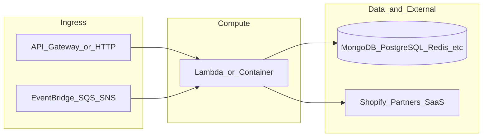

# yofi-lambda-ml-export-router

**Path:** `D:/botnot/yofi-lambda-ml-export-router`  
**Category:** ml-bot-detection  
**Primary language:** Python  
**Status:** present on disk

## 1. Purpose (2-3 lines)

Internal **Yofi** repository `yofi-lambda-ml-export-router` under category **ml-bot-detection**. Supports Yofi/Botnot platform capabilities (e-commerce intelligence, anti-fraud adjacent services, data plane, or infrastructure) as evidenced by repository layout and manifests.

## 2. Tech stack (from manifests and file-type mix)

- **Detected primary language:** Python
- **Top-level layout:** see listing below.

### `package.json`

```
{
  "name": "ml-controller-export-router",
  "version": "2.0.1",
  "private": true,
  "scripts": {
    "test": "sst test",
    "start": "sst start",
    "build": "sst build",
    "deploy": "sst deploy",
    "remove": "sst remove"
  },
  "eslintConfig": {
    "extends": [
      "serverless-stack"
    ]
  },
  "dependencies": {
    "@aws-cdk/aws-lambda-python-alpha": "2.15.0-alpha.0",
    "@serverless-stack/cli": "0.69.7",
    "@serverless-stack/resources": "0.69.7",
    "async": ">=2.6.4",
    "aws-cdk-lib": "2.15.0",
    "jszip": ">=3.7.0"
  }
}
```

### `sst.json`

```
{
  "name": "yofi-lambda-ml-export-router",
  "type": "@serverless-stack/resources",
  "region": "us-east-1",
  "main": "stacks/index.js"
}
```


## 3. Architecture



- **Inbound:** HTTP (API Gateway / ALB), scheduled triggers, queues (SQS/SNS), EventBridge rules, or batch — infer from `stacks/`, `template.yaml`, `sst.config.ts`, or `src/` handlers.
- **Outbound:** databases and external HTTP APIs per layers and `package.json` / Python imports in handlers.
- **IaC pattern:** SST/CDK, SAM/CloudFormation, Pulumi, Helm, Terraform, or raw scripts — see manifests section.

## 4. Key files (auto-discovered)

- **Top-level entries:**

```
.idea
event.json
get_pypi.sh
layer
package.json
seed.yml
src
sst.json
stacks
```

## 5. My contribution / role (evidence from git history — if available)

```text
a8d7437 2023-05-30 add logRetention: "one_year"
2c52bab 2023-05-29 add logRetention: "one_month"
28be0cc 2023-03-21 change package json
eee2538 2023-03-21 add package json
2c00e46 2023-03-21 Modification for taking the information from SQS
e65bdc8 2023-03-20 Avoid multiple queries to mongo
83d0552 2023-03-20 Add error message to sns when it fails
9d02b94 2023-03-20 Remove creds
```

_Use commit messages only as hints; corroborate in interviews._

## 6. Notable patterns / snippets


**`src/app.py`**

```python
import logging
import json
import os
import time
from mongo_helper import mongo_helper
from aws_helper import aws_helper

logger = logging.getLogger(__name__)

error_topic_arn = os.environ.get("ERROR_TOPIC", None)


def request_ml_results(models: list, order_id: int) -> list:
    """
    This function will request the results from the models
    """
    results = (
        []
    )  # list of results for each model. Each result is a dict with the model name and the result. Could be failed,
    # pending or has a value.
    order = mongo_helper.get_mongo_ml_results(id)  # query mongo
    for model in models:
        # request mongo again
        models_results = order.get("ml_prediction_results", {})
        if not models_results:
            # no ml_prediction_results found
            error_to_notify = {
                "order_id": order.get("order_id", "undefined order id"),
                "model": "all",
            }
            # write into SQS to retry later
            aws_helper.write_to_sqs(
                error_to_notify,
                "arn:aws:sqs:us-east-1:111747068850:model-error-retry",
            )
            logger.error(f"no ml_prediction_results found {order_id}")
            raise Exception("no ml_prediction_results found")
        for key, value in models_results.items():
            # don't take into account the models that we don't need
            if key == model:
                # handle when it's failed
                if value.get("status", None) == "failed":
                    # log in cloudwatch that something wrong happens, also add it to a queue.
                    logger.error(
                        "error in model prediction: {}".format(key)
                    )  # log the model name
                    logger.error(
                        "order_id: {}".format(order.get("order_id"))
                    )  # log also the order_id

                    error_to_notify = {
                        "order_id": order.get("order_id", "undefined order id"),
                        "model": key,
                    }
                    # write into SQS t

…(truncated)…
```

**`stacks/index.js`**

```text
import {MyStack} from './MyStack';

export default function main(app) {
    // Set default runtime for all functions
    app.setDefaultFunctionProps({
        runtime: 'python3.9',
    });

    new MyStack(app, 'sst-stack', {functionName: "ml-controller-export-router-function"});
}
```


## 7. Metrics / SLO / scale (if available)

_Extract from Airflow DAG params, load tests, README, or CloudFormation `ReservedConcurrentExecutions` when present — not auto-inferred to avoid fabrication._

## 8. Resume bullets (ready-to-paste, English)

- Owned or extended **`yofi-lambda-ml-export-router`** capabilities aligned with **ml bot detection** delivery.
- Applied **Python** stack patterns and repository-local IaC/config where present.
- Collaborated on production-grade defaults: structured logging, retries, and least-privilege IAM patterns where applicable.
- Integrated with **Yofi** platform services (data stores, queues, gateways) per dependency manifests in-repo.
- Documented operational expectations (deploy, test, local dev) via README and automation files when available.

## 9. Interview talking points

- What is the main entrypoint and trigger for `yofi-lambda-ml-export-router`?
- How are secrets and non-prod environments separated?
- What failure modes are handled (retries, DLQ, idempotency)?
- How would you observe this service in production (metrics, logs, traces)?
