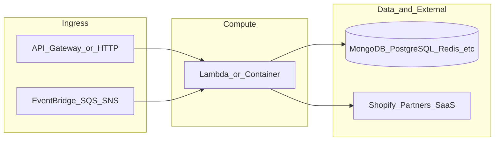

# yofi-lambda-ml-gateway

**Path:** `D:/botnot/yofi-lambda-ml-gateway`  
**Category:** ml-bot-detection  
**Primary language:** Python  
**Status:** present on disk

## 1. Purpose (2-3 lines)

# Shared Lambda for ML models on GCP

### Verifies which ML model can run
1. Receives payload from the controller (SNS+SQS) with filtering
2. According to the filter run one model or another
3. Save/update ML predictions to MongoDB (shadow)

`Eugenio Grytsenko`

## 2. Tech stack (from manifests and file-type mix)

- **Detected primary language:** Python
- **Top-level layout:** see listing below.

### `README.md`

```
# Shared Lambda for ML models on GCP

### Verifies which ML model can run
1. Receives payload from the controller (SNS+SQS) with filtering
2. According to the filter run one model or another
3. Save/update ML predictions to MongoDB (shadow)

`Eugenio Grytsenko`
```

### `readme.md`

```
# Shared Lambda for ML models on GCP

### Verifies which ML model can run
1. Receives payload from the controller (SNS+SQS) with filtering
2. According to the filter run one model or another
3. Save/update ML predictions to MongoDB (shadow)

`Eugenio Grytsenko`
```

### `Readme.md`

```
# Shared Lambda for ML models on GCP

### Verifies which ML model can run
1. Receives payload from the controller (SNS+SQS) with filtering
2. According to the filter run one model or another
3. Save/update ML predictions to MongoDB (shadow)

`Eugenio Grytsenko`
```

### `package.json`

```
{
  "engines": {
    "node": ">=18.0.0",
    "npm": "9.5.0"
  },
  "name": "yofi-lambda-ml-gateway",
  "version": "1.4.2",
  "private": true,
  "scripts": {
    "test": "sst test",
    "start": "sst start",
    "build": "sst build",
    "deploy": "sst deploy",
    "remove": "sst remove"
  },
  "eslintConfig": {
    "extends": [
      "serverless-stack"
    ]
  },
  "devDependencies": {
    "@aws-cdk/aws-lambda-python-alpha": "2.132.1-alpha.0",
    "@tsconfig/node16": "1.0.3",
    "async": "^3.2.6",
    "aws-cdk-lib": "2.132.1",
    "constructs": "10.3.0",
    "jszip": "^3.10.1",
    "sst": "2.48.5",
    "ts-node": "^10.9.2",
    "typescript": "^4.9.5"
  }
}
```

### `sst.config.ts`

```
import type {SSTConfig} from "sst"

// @ts-ignore
import {MlGatewayServiceStack} from "./stacks/MainStack.ts"

export default {
    config(input) {
        return {
            name: "yofi-backend-lambda-ml-gateway",
            region: "us-east-1",
            profile: input.stage === "prod" ? "prod" : "dev",
        }
    },
    stacks(app) {
        app.setDefaultFunctionProps({
            // handler: 'src/lambda.handler',
            runtime: 'python3.12',
            tracing: "disabled",
            timeout: 30
        })

        app.stack(MlGatewayServiceStack, {id: "sst-stack"})
    },
} satisfies SSTConfig
```


## 3. Architecture



- **Inbound:** HTTP (API Gateway / ALB), scheduled triggers, queues (SQS/SNS), EventBridge rules, or batch — infer from `stacks/`, `template.yaml`, `sst.config.ts`, or `src/` handlers.
- **Outbound:** databases and external HTTP APIs per layers and `package.json` / Python imports in handlers.
- **IaC pattern:** SST/CDK, SAM/CloudFormation, Pulumi, Helm, Terraform, or raw scripts — see manifests section.

## 4. Key files (auto-discovered)

- **Top-level entries:**

```
.bandit
.github
.gitignore
.idea
.pre-commit-config.yaml
README.md
layer-common
node_modules
package-lock.json
package.json
seed.yml
src
sst.config.ts
stacks
test
```

## 5. My contribution / role (evidence from git history — if available)

```text
7bcf414 2025-08-14 Merge pull request #150 from BotNotOrg/dev
b86f47e 2025-08-13 Merge pull request #154 from BotNotOrg/ci/update-commit-hash
c566be7 2025-08-13 chore: Update commit hash to 57e6ef3ee825e5f6112a42e7776e8fde7db1f69b
02b63f1 2025-08-13 Merge pull request #153 from BotNotOrg/chore/log_predictions
d8285fa 2025-08-13 chore: add logging for customer and order predictions
af25877 2025-08-12 Fix the bug
d72434e 2025-08-12 Fix the bug
61f6c09 2025-08-12 Fix the bug
```

_Use commit messages only as hints; corroborate in interviews._

## 6. Notable patterns / snippets


**`src/main.py`**

```python
import json
import os
from yofi_common_libs import YofiSpannerClient
from yofi_common_libs.order_event import retrieve_payload, push_to_downstream
from yofi_rules.rules.shopify import (
    ShopifyClaimAbusersModel,
    ShopifyResellersModel,
    ShopifyReturnAbusersModel,
    ShopifyReturnFraudstersModel,
)

from libs.constants import (BOT_ABUSE_SCORE, RETURN_ABUSE_SCORE, RESELL_ABUSE_SCORE, FAKE_PROFILE_SCORE,
                            LLM_CUSTOMER_ABUSE_SCORE, MODEL_PREDICTION, REPREDICT_ORDER, FTID_FRAUD_SCORE)
from libs.helper import logger, mongodb, publish_to_export_service, customer_predictions_updated, repredict_orders
from libs.rules import PredictionLevel
from libs.utils import push_save_event_history, get_app_prediction_settings
from models import (OrderIsPlacedByBotRBM, CustomerBotAbuserRBM,  CustomerReturnAbuserRBM,
                    CustomerResellAbuserRBM, CustomerFakeProfileRBM, CustomerCancellationAbuserRBM,
                    CustomerAbusePredictionsLLM, OrderHighReturnChanceRisk, OrderHighCancellationChanceRisk,
                    OrderHighResellChanceRisk, OrderHighFTIDChanceRisk)
from prediction_runner import PredictionRunner

SPANNER = YofiSpannerClient()


def process_records(record):
    logger.debug("order in process-> %s", json.dumps(record))

    order_event = json.loads(record.get("body"))
    shop_url = order_event.get("shop_url")
    order_id = order_event.get("_id")
    logger.info(f'Processing {shop_url} | {order_id} | {order_event["_id"]}')

    is_repredict_event = order_event.get("event_type") == REPREDICT_ORDER

    if order_event.get("payload_type"):
        order = retrieve_payload(order_event)
        is_repredict_event = order.get("event_type") == REPREDICT_ORDER  # TODO: make it simpler
    else:
        logger.warning(f"Deprecated events: Retrieve order from db")
        order = SPANNER.get_entity_order(order_id, [shop_url])

    if not order:
        logger.warning(f"Order = {order_id} missed for shop:{shop_url}")
        return

    customer_id = order.get("customer", {}).get("_id")
    customer_columns = ["customer_id", "shop_url", "analytics", 

…(truncated)…
```


## 7. Metrics / SLO / scale (if available)

_Extract from Airflow DAG params, load tests, README, or CloudFormation `ReservedConcurrentExecutions` when present — not auto-inferred to avoid fabrication._

## 8. Resume bullets (ready-to-paste, English)

- Owned or extended **`yofi-lambda-ml-gateway`** capabilities aligned with **ml bot detection** delivery.
- Applied **Python** stack patterns and repository-local IaC/config where present.
- Collaborated on production-grade defaults: structured logging, retries, and least-privilege IAM patterns where applicable.
- Integrated with **Yofi** platform services (data stores, queues, gateways) per dependency manifests in-repo.
- Documented operational expectations (deploy, test, local dev) via README and automation files when available.

## 9. Interview talking points

- What is the main entrypoint and trigger for `yofi-lambda-ml-gateway`?
- How are secrets and non-prod environments separated?
- What failure modes are handled (retries, DLQ, idempotency)?
- How would you observe this service in production (metrics, logs, traces)?
