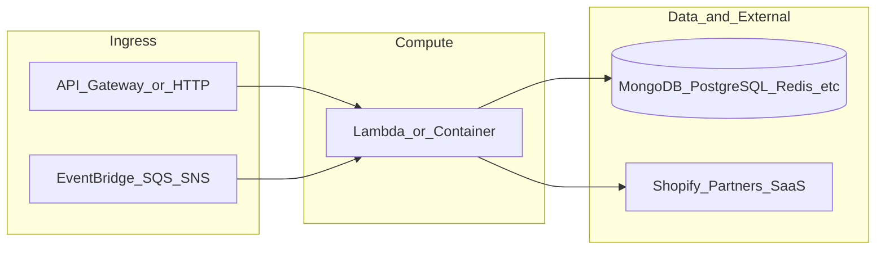

# yofi-telemetry-predictions

**Path:** `D:/botnot/yofi-telemetry-predictions`  
**Category:** ml-bot-detection  
**Primary language:** Python  
**Status:** present on disk

## 1. Purpose (2-3 lines)

# disqo_telemetry_predict

# 1 FastAPI description

## 2. Tech stack (from manifests and file-type mix)

- **Detected primary language:** Python
- **Top-level layout:** see listing below.

### `README.md`

```
# disqo_telemetry_predict

# 1 FastAPI description
## install py packages.
pip install fastapi==0.115.1 uvicorn==0.32.1

## start server
In Windows:
$env:PYTHONPATH="disqo_prediction"; uvicorn disqo_prediction.main:app --reload

In linux/macOS:
PYTHONPATH=disqo_prediction uvicorn disqo_prediction.main:app --reload

# 2 API description
## 2.1 user prediction

POST method:
/pred/user/

where body is all the user's telemetry features.
In this format:
[
    {
        "journey_id": "111",
        "features": {
            "cloudBehavioral": {},
            "journeyMetadata": {}
        }
    },
    {
        "journey_id": "112",
        "features": {
            "cloudBehavioral": {},
            "journeyMetadata": {}
        }
    },
    {
        "journey_id": "113",
        "features": {
            "cloudBehavioral": {},
            "journeyMetadata": {}
        }
    }
]

## 2.2 journey predictions
TBD
```

### `readme.md`

```
# disqo_telemetry_predict

# 1 FastAPI description
## install py packages.
pip install fastapi==0.115.1 uvicorn==0.32.1

## start server
In Windows:
$env:PYTHONPATH="disqo_prediction"; uvicorn disqo_prediction.main:app --reload

In linux/macOS:
PYTHONPATH=disqo_prediction uvicorn disqo_prediction.main:app --reload

# 2 API description
## 2.1 user prediction

POST method:
/pred/user/

where body is all the user's telemetry features.
In this format:
[
    {
        "journey_id": "111",
        "features": {
            "cloudBehavioral": {},
            "journeyMetadata": {}
        }
    },
    {
        "journey_id": "112",
        "features": {
            "cloudBehavioral": {},
            "journeyMetadata": {}
        }
    },
    {
        "journey_id": "113",
        "features": {
            "cloudBehavioral": {},
            "journeyMetadata": {}
        }
    }
]

## 2.2 journey predictions
TBD
```

### `Readme.md`

```
# disqo_telemetry_predict

# 1 FastAPI description
## install py packages.
pip install fastapi==0.115.1 uvicorn==0.32.1

## start server
In Windows:
$env:PYTHONPATH="disqo_prediction"; uvicorn disqo_prediction.main:app --reload

In linux/macOS:
PYTHONPATH=disqo_prediction uvicorn disqo_prediction.main:app --reload

# 2 API description
## 2.1 user prediction

POST method:
/pred/user/

where body is all the user's telemetry features.
In this format:
[
    {
        "journey_id": "111",
        "features": {
            "cloudBehavioral": {},
            "journeyMetadata": {}
        }
    },
    {
        "journey_id": "112",
        "features": {
            "cloudBehavioral": {},
            "journeyMetadata": {}
        }
    },
    {
        "journey_id": "113",
        "features": {
            "cloudBehavioral": {},
            "journeyMetadata": {}
        }
    }
]

## 2.2 journey predictions
TBD
```


## 3. Architecture



- **Inbound:** HTTP (API Gateway / ALB), scheduled triggers, queues (SQS/SNS), EventBridge rules, or batch — infer from `stacks/`, `template.yaml`, `sst.config.ts`, or `src/` handlers.
- **Outbound:** databases and external HTTP APIs per layers and `package.json` / Python imports in handlers.
- **IaC pattern:** SST/CDK, SAM/CloudFormation, Pulumi, Helm, Terraform, or raw scripts — see manifests section.

## 4. Key files (auto-discovered)

- **Top-level entries:**

```
.github
.gitignore
README.md
disqo_prediction
```

## 5. My contribution / role (evidence from git history — if available)

```text
46da43e 2025-06-25 fix: calculate user bot (#19)
592a3dc 2025-06-24 fix: remove multiple device info rule (#18)
31959d7 2025-05-08 Feature/fix none type (#17)
03acc60 2025-05-07 feat: add realtime user bot prediction (#16)
37c98b5 2025-04-28 Merge pull request #15 from BotNotOrg/feature/user_bot_pred
64326b2 2025-04-28 fix: label name
b508034 2025-04-25 Merge pull request #14 from BotNotOrg/feature/fix_multiple_monitor
e8701f5 2025-04-25 fix: remove multiple monitors rule
```

_Use commit messages only as hints; corroborate in interviews._

## 6. Notable patterns / snippets


**`disqo_prediction/main.py`**

```python
import lightgbm as lgb
import numpy as np
from datetime import datetime

from fastapi import FastAPI, Request
from fastapi.responses import JSONResponse

from yofi_common_libs.log_k8s import klogger

from journey_pred_lib import (get_features_from_journey, get_journey_risk_level,
                              calc_rule_based_score, auctane_journey_bot_detection,
                              general_journey_bot_detection)
from prediction_lib import bot_detection
from user_pred_lib import calc_user_score, parse_user_features, get_user_risk_level
from llm_pred_lib import get_llm_prediction
from constants import AUCTANE_APP_ID

app = FastAPI()

JOURNEY_MODEL_PATH = "./model/journey_prediction_model.txt"
journey_model = lgb.Booster(model_file=JOURNEY_MODEL_PATH)

TREE_MODEL_WHITE_LIST = [
    "f394e581-4527-4bab-83cc-095ebd909f36"
]


def get_process_time():
    now = datetime.utcnow()
    formatted_time = now.strftime('%Y-%m-%dT%H:%M:%S.') + f'{now.microsecond:06d}' + 'Z'
    return formatted_time


def create_prediction_response(
        valid: bool,
        risk_score: float,
        risk_level: str,
        explanation: str,
        model_version: str,
        message: str = "Predict successfully"
) -> JSONResponse:
    """
    Creates a standardized prediction response.
    
    Args:
        valid: Whether the prediction is valid
        risk_score: The calculated risk score
        risk_level: The risk level classification
        explanation: Additional explanation for the prediction
        model_version: Version of the model used
        message: Response message
        
    Returns:
        JSONResponse with standardized format
    """
    response = {
        "valid": valid,
        "risk_score": risk_score,
        "risk_level": risk_level,
        "explanation": explanation,
        "created_at": get_process_time(),
        "updated_at": get_process_time(),
        "model_version": model_version,
        "message": message
    }
    return JSONResponse(content={
        "response_data": response
    }, status_code=200)


@app.post("/pred/user/")
async def user_p

…(truncated)…
```


## 7. Metrics / SLO / scale (if available)

_Extract from Airflow DAG params, load tests, README, or CloudFormation `ReservedConcurrentExecutions` when present — not auto-inferred to avoid fabrication._

## 8. Resume bullets (ready-to-paste, English)

- Owned or extended **`yofi-telemetry-predictions`** capabilities aligned with **ml bot detection** delivery.
- Applied **Python** stack patterns and repository-local IaC/config where present.
- Collaborated on production-grade defaults: structured logging, retries, and least-privilege IAM patterns where applicable.
- Integrated with **Yofi** platform services (data stores, queues, gateways) per dependency manifests in-repo.
- Documented operational expectations (deploy, test, local dev) via README and automation files when available.

## 9. Interview talking points

- What is the main entrypoint and trigger for `yofi-telemetry-predictions`?
- How are secrets and non-prod environments separated?
- What failure modes are handled (retries, DLQ, idempotency)?
- How would you observe this service in production (metrics, logs, traces)?
