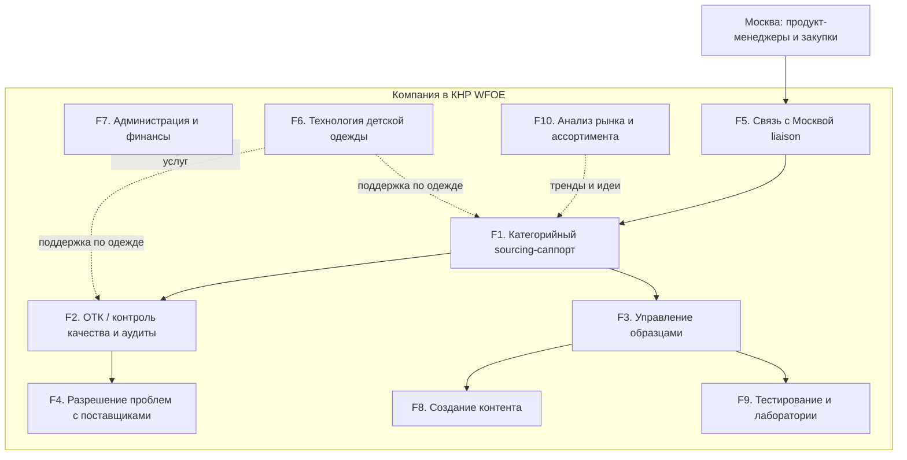

# Функциональная структура компании «Детского Мира» в КНР

> **Тип документа:** функциональная структура с детальным описанием  
> **Форма присутствия:** **WFOE (外商独资企业)** — торговая компания со 100% иностранным капиталом и **правом экспорта/импорта**; HQ в Шанхае + полевой QC-узел в Гуанчжоу  
> **Горизонт:** первые 6 месяцев с момента запуска  
> **Базовый принцип:** в первые 6 месяцев (Фаза 1) компания **не ведёт торговлю и не экспортирует** — экспортная лицензия оформляется «про запас», а компания работает как **сервисный центр**, финансируемый по сервисным договорам с материнской компанией  
> **Связанные документы:** [02_org_structure.md](02_org_structure.md), [03_budget_6m.md](03_budget_6m.md), [04_setup_development_plan_6m.md](04_setup_development_plan_6m.md), [05_horizontal_interactions_moscow.md](05_horizontal_interactions_moscow.md), [06_sample_delivery_scheme_payment.md](06_sample_delivery_scheme_payment.md)

---

## 1. Миссия и принципы

**Миссия:** обеспечить московскому офису «Детского Мира» прямой, контролируемый и быстрый доступ к китайским фабрикам — через сорсинг, сбор и преселекцию образцов, контроль качества на месте, создание контента, организацию тестирования, анализ рынка и оперативное разрешение проблем с поставщиками.

**Принципы работы (Фаза 1):**
- Юридическая форма — **WFOE (торговая компания с правом экспорта)**, но в первые 6 месяцев компания **не экспортирует и не торгует на собственный баланс**: экспортно-импортная лицензия и таможенная регистрация оформляются заранее, чтобы быть готовыми к Фазе 2.
- Компания — **сервисный центр для закупочного блока РФ**: вся деятельность первых 6 месяцев оформлена как **набор услуг по сервисным договорам с материнской компанией** (см. финансовую модель в [03_budget_6m.md](03_budget_6m.md)).
- **Самостоятельное финансирование через выручку от услуг:** компания выставляет материнской компании счета за сорсинг, QC, работу с образцами, контент, тестирование и аналитику; модель ценообразования — **cost-plus** (себестоимость + наценка).
- **«Глаза и руки» компании в Китае:** физическое присутствие на фабриках вместо удалённой работы через агентов.
- Опора на **локальную команду** (категорийные менеджеры, ОТК, контент, аналитик, бухгалтер — граждане КНР) при **русском управлении и технадзоре** (директор, технолог).

---

## 2. Карта функциональных блоков

Десять функциональных блоков. F1–F5 — основная операционная цепочка; F6 — специализированная экспертиза (детская одежда); F8–F10 — добавленные функции из требований бизнеса (контент, тестирование, аналитика); F7 — обеспечивающая функция, включая биллинг услуг материнской компании.

---

## 3. Детальное описание функций

### F1. Категорийный sourcing-саппорт (одежда, игрушки, аксессуары)

| Параметр | Содержание |
|---|---|
| **Цель** | Поддержка продукт-менеджеров Москвы в работе с заводами: поиск/верификация фабрик, ведение пула поставщиков, сопровождение размещения заказов по своим категориям |
| **Состав работ** | — Поиск поставщиков под конкретное ТЗ, в т.ч. для структурно сложных категорий (игрушки, КИУ) — Анализ рынка поставщиков для сокращения времени подбора и расширения числа кандидатов — Поиск оптимизационных решений (цена, MOQ, сроки) — Верификация фабрик (бизнес-лицензия, мощности, экспортный опыт) — Ведение и актуализация списка одобренных поставщиков (AVL) — Сбор коммерческих предложений, спецификаций, прайсов — Мониторинг трендов и новинок (Canton Fair, Yiwu, профильные выставки) |
| **Входы** | Запрос/бриф (ТЗ) от ПМ Москвы, спецификация товара, целевая цена |
| **Выходы** | Верифицированный поставщик, КП, спецификация, рекомендация ПМ |
| **Владелец** | Категорийные менеджеры (CN) — по одной на категорию: одежда / игрушки / аксессуары |
| **KPI** | — Время ответа на запрос ПМ ≤ 2 раб. дня — Кол-во новых верифицированных фабрик / квартал — Доля закрытых брифов в срок ≥ 90% |
| **Сервисный договор** | Оплачивается материнской компанией как «sourcing fee» (см. [03_budget_6m.md](03_budget_6m.md)) |

### F2. ОТК / контроль качества и аудиты

| Параметр | Содержание |
|---|---|
| **Цель** | Проверка качества партии на фабрике **до отгрузки** + регулярные аудиты фабрик, складов и логистических партнёров |
| **Состав работ** | — Pre-shipment инспекция по методике **AQL 2.5** (выборочный контроль) — Точечные проверки качества продукции — Регулярные аудиты фабрик, складов и логистических партнёров (на месте, не только дистанционно) — Мониторинг соблюдения сроков и объёмов поставок — Проверка соответствия спецификации, маркировки, упаковки — Контроль соответствия GB/CCC и требованиям РФ (EAC/ТР ТС) — Фотофиксация и отчёт об инспекции (PSI report) — Решение «разрешить отгрузку / задержать / переделать» — Промежуточные инспекции (DUPRO) для крупных/проблемных заказов |
| **Входы** | Уведомление о готовности партии, спецификация, утверждённый образец-эталон, план аудитов |
| **Выходы** | PSI-отчёт, отчёт аудита, вердикт по отгрузке, перечень дефектов |
| **Владелец** | Руководитель ОТК (CN) + инспекторы ОТК (CN), полевая база — Гуанчжоу/Чэнхай |
| **KPI** | — Уровень дефектности отгруженных партий **< 1,5%** — 100% партий по приоритетным SKU проходят PSI — Срок выпуска PSI-отчёта ≤ 1 раб. день после инспекции |
| **Сервисный договор** | «QC / inspection / audit fee» — оплата за инспекцию/аудит |

### F3. Управление образцами (sample management)

| Параметр | Содержание |
|---|---|
| **Цель** | Сбор, преселекция образцов с фабрик и быстрая консолидированная отправка в Россию для оценки и утверждения ПМ |
| **Состав работ** | — Первичная обработка потока образцов по всем категориям, **преселекция** — Получение образцов от фабрик, входная проверка — **Консолидация образцов** для отправки в РФ — **Оперативное согласование предпроизводственных образцов (PPS) с привлечением ЦО** — Ведение библиотеки/шоурума образцов в офисе — Маркировка, описание, фотофиксация образцов — Отправка партий образцов авиа в Москву + трекинг — Оформление товаросопроводительных документов на образцы — Хранение эталонных образцов для последующего ОТК |
| **Входы** | Запрос образца от ПМ, образцы от фабрик |
| **Выходы** | Преселектированная и отправленная партия образцов + трекинг, запись в библиотеке образцов |
| **Владелец** | Категорийные менеджеры (CN) + офис-администратор (CN, логистика отправок) |
| **KPI** | — Срок «фабрика → отправка в РФ» **3–7 дней** — 100% образцов с фотофиксацией и описанием — Доля корректно оформленных отправок ≥ 98% |
| **Сервисный договор** | «Sample management & shipping fee» — оплата за обработку и отправку образцов |

### F4. Разрешение проблем с поставщиками (брак и задержки)

| Параметр | Содержание |
|---|---|
| **Цель** | Оперативный выезд на фабрику и проверка реального состояния при браке или срыве сроков |
| **Состав работ** | — Выезд на фабрику для проверки фактического статуса производства — Расследование причин брака/задержки (root cause) — Фиксация фактического состояния (фото/видео, акты) — Переговоры по переделке, замене, компенсации, ускорению — Контроль исполнения корректирующих действий (CAPA) — Эскалация в Москву при неразрешимых ситуациях |
| **Входы** | Сигнал о браке/задержке от ПМ Москвы или от ОТК |
| **Выходы** | Акт проверки фабрики, план корректирующих действий, статус-отчёт ПМ |
| **Владелец** | Руководитель ОТК (CN) + профильный категорийный менеджер (CN); технадзор — директор (RU) |
| **KPI** | — Срок выезда на фабрику ≤ 3 раб. дня с момента сигнала — Доля кейсов, разрешённых без эскалации в РФ ≥ 80% — Среднее время закрытия кейса брака |
| **Сервисный договор** | Входит в «QC / audit fee» (выезды и расследования) |

### F5. Связь с московским офисом (liaison)

| Параметр | Содержание |
|---|---|
| **Цель** | Единое окно взаимодействия компании с продукт-менеджерами и закупками Москвы |
| **Состав работ** | — Приём, приоритизация и распределение запросов ПМ внутри компании — Регулярная отчётность (еженедельный статус по образцам, QC, контенту, кейсам) — Согласование приоритетов и сроков с учётом разницы часовых поясов — Ведение общего трекера задач и базы поставщиков — Подготовка управленческой отчётности для руководства РФ — Сопровождение сервисных договоров и актов выполненных работ с материнской компанией |
| **Входы** | Запросы и приоритеты от Москвы |
| **Выходы** | Распределённые задачи, статус-отчёты, эскалации, акты по сервисным договорам |
| **Владелец** | Генеральный директор компании (RU) |
| **KPI** | — SLA по первичному ответу на запрос ≤ 1 раб. день — Еженедельный статус-отчёт без срывов — Удовлетворённость ПМ Москвы (внутренний опрос) |

Детали процессов и SLA — в [05_horizontal_interactions_moscow.md](05_horizontal_interactions_moscow.md).

### F6. Технология детской одежды (доп. функция)

| Параметр | Содержание |
|---|---|
| **Цель** | Техническая экспертиза по пошиву детской одежды: повышение качества и технологичности изделий на стороне фабрик |
| **Состав работ** | — Разработка/проверка технических пакетов (tech pack): лекала, посадка, размерная сетка — Контроль конструкции, материалов, фурнитуры, швов — Утверждение pre-production sample (PPS) по одежде — Контроль соответствия GB 31701 (безопасность детской одежды) и требований РФ — Обучение/настройка фабрик под требования «Детского Мира» — Поддержка категорийного менеджера по одежде и ОТК в части технологии |
| **Входы** | Tech pack/дизайн от ПМ одежды Москвы, образцы |
| **Выходы** | Утверждённый PPS, скорректированный tech pack, заключение по технологичности |
| **Владелец** | Технолог по детской одежде (RU) |
| **KPI** | — Доля одобренных с первого раза PPS по одежде — Снижение дефектности по швейным изделиям — Время согласования tech pack |

### F7. Администрация и финансы

| Параметр | Содержание |
|---|---|
| **Цель** | Юридическое, финансовое и хозяйственное обеспечение деятельности WFOE + биллинг услуг материнской компании |
| **Состав работ** | — Бухгалтерский и налоговый учёт WFOE (НДС 6% на услуги, налог на прибыль CIT 25% на наценку) — **Выставление счетов и актов материнской компании по сервисным договорам (cost-plus)** — Расчёты с персоналом, соцстрахование локального штата — Платежи поставщикам услуг, командировочные, аренда — Документооборот, ведение печатей (chops), корпоративный банковский счёт, валютные операции (SAFE) — Соблюдение требований годовой отчётности, аудита и налоговой — Офисное и визовое обеспечение (Z-визы экспатов) |
| **Входы** | Первичные документы, табели, счета, реестры выполненных услуг |
| **Выходы** | Отчётность, проведённые платежи, выставленные счета/акты, закрытый учёт |
| **Владелец** | Бухгалтер (CN) + офис-администратор (CN); надзор — директор (RU); внешний аудит/налоги — аутсорс-консультант |
| **KPI** | — 0 нарушений по срокам налоговой/годовой отчётности — Своевременный биллинг услуг (ежемесячные акты) — Закрытие месяца в срок — 0 инцидентов комплаенса |

### F8. Создание контента (фото/видео)

| Параметр | Содержание |
|---|---|
| **Цель** | Производство фото- и видеоконтента для товарных категорий и обеспечение готовности контента к старту продаж |
| **Состав работ** | — Частичное производство фото- и видеоконтента по товарным категориям — Съёмка образцов и новинок на месте (в офисе/на фабриках) — Обеспечение готовности контента к старту продаж (в т.ч. для ТНП — до поступления партии на РЦ) — Подготовка и передача контента в форматах ЦО Москвы — Координация с категорийными менеджерами по приоритетам съёмок |
| **Входы** | Преселектированные образцы (F3), бриф на контент от ПМ/маркетинга Москвы |
| **Выходы** | Готовые фото/видео-материалы по SKU, переданные в Москву |
| **Владелец** | Контент-продюсер (CN) при поддержке офис-администратора |
| **KPI** | — Доля SKU с готовым контентом к старту продаж — Срок «образец → готовый контент» — Объём произведённого контента / мес |
| **Сервисный договор** | «Content production fee» |

### F9. Тестирование и лаборатории (lab testing coordination)

| Параметр | Содержание |
|---|---|
| **Цель** | Организация тестирования материалов и образцов и оперативное получение результатов исследований |
| **Состав работ** | — Организация тестирования материалов и готовых образцов в аккредитованных лабораториях (SGS / BV / Intertek-класс) — Подбор методик под требования РФ (ТР ТС) и GB-стандарты — Контроль сроков и оперативное получение протоколов — Ведение реестра результатов тестов по поставщикам/SKU — Передача протоколов в Москву, поддержка ОТК и технолога |
| **Входы** | Запрос на тест от ПМ/ОТК/технолога, образцы и материалы |
| **Выходы** | Протоколы испытаний, заключение о соответствии, запись в реестре |
| **Владелец** | Координатор тестирования (CN) во взаимодействии с ОТК и технологом |
| **KPI** | — Срок получения результатов теста — Доля SKU с пройденными обязательными тестами — 0 срывов по обязательным испытаниям перед стартом |
| **Сервисный договор** | «Lab testing coordination fee»; счета лабораторий — pass-through (перевыставляются материнской компании) |

### F10. Анализ рынка и развитие ассортимента

| Параметр | Содержание |
|---|---|
| **Цель** | Выявление «волн спроса» в Азии и трансляция перспективных идей и трендов в ассортимент компании |
| **Состав работ** | — Выявление «волн спроса» и трендов в Азии — Анализ рынка поставщиков и новинок (выставки, маркетплейсы, соцсети КНР) — Трансляция перспективных идей и трендов в ассортимент «Детского Мира» — Содействие сокращению цикла «идея → полка в РФ» — Подготовка регулярных аналитических обзоров для ПМ Москвы — Работа с CRM и инструментами аналитики |
| **Входы** | Данные рынка, выставки, запросы ПМ/категорийного блока Москвы |
| **Выходы** | Аналитические обзоры, шорт-листы трендовых категорий и SKU, рекомендации |
| **Владелец** | Аналитик рынка (CN) во взаимодействии с категорийными менеджерами |
| **KPI** | — Кол-во принятых в ассортимент идей/трендов — Сокращение цикла «идея → полка» — Регулярность и качество аналитических обзоров |
| **Сервисный договор** | «Market intelligence retainer» |

---

## 4. Матрица «функция → роль» (RACI)

> R — Responsible (исполняет), A — Accountable (отвечает за результат), C — Consulted (консультирует), I — Informed (информируется)

| Функция | Директор (RU) | Кат. менеджеры (CN) | ОТК (CN) | Технолог (RU) | Контент (CN) | Тестир. (CN) | Аналитик (CN) | Бухгалтер (CN) | Офис-админ (CN) | ПМ Москва |
|---|---|---|---|---|---|---|---|---|---|---|
| F1. Sourcing-саппорт | A | R | C | C | I | I | C | I | I | C/I |
| F2. ОТК / QC и аудиты | A | C | R | C (одежда) | I | C | I | I | I | I |
| F3. Образцы | A | R | C | C (одежда) | C | C | I | I | R (логистика) | C/I |
| F4. Брак и задержки | A | C/R | R | C (одежда) | I | C | I | I | I | C/I |
| F5. Связь с Москвой | A/R | C | C | C | I | I | C | I | I | C |
| F6. Технология одежды | A | C | C | R | I | C | I | I | I | C |
| F7. Администрация/финансы | A | I | I | I | I | I | I | R | R | I |
| F8. Контент | A | C | I | I | R | I | C | I | C | C |
| F9. Тестирование | A | C | C | C (одежда) | I | R | I | I | I | C/I |
| F10. Анализ рынка | A | C | I | I | I | I | R | I | I | C |

---

## 5. Что НЕ входит в scope (out-of-scope, Фаза 1)

Прямо исключено из деятельности компании на первые 6 месяцев:

- **Экспорт и торговля на собственный баланс** — экспортная лицензия оформлена, но **не используется**; в Фазе 1 компания только оказывает услуги.
- **Заключение контрактов на закупку/импорт/экспорт товара** — контракты на товар ведёт головная компания в РФ.
- **Прямые расчёты с фабриками за товар** — платежи за товар идут через головную компанию; WFOE оперирует только сервисной выручкой и операционным бюджетом (исключение — pass-through лабораторных счетов в рамках F9).
- **Складирование и таможенное оформление товарных партий** — функция логистики РФ/подрядчиков.
- **B2C / маркетплейс-активности в Китае.**

> Право экспорта реализуется в **Фазе 2** (консолидация закупок, B2B-операции), решение принимается по итогам 6 месяцев (см. [04_setup_development_plan_6m.md](04_setup_development_plan_6m.md)).

---

## 6. Связь функций с пожеланиями руководства и требованиями вакансии

| Пожелание / требование | Покрывающая функция |
|---|---|
| 1. Сбор, преселекция и отправка образцов из Китая в Россию | **F3. Управление образцами** |
| 2. Проверка качества на фабрике, аудиты фабрик/складов/логистики, мониторинг поставок | **F2. ОТК / контроль качества и аудиты** |
| 3. Работа с поставщиками по браку и задержкам, выезды на фабрику | **F4. Разрешение проблем с поставщиками** |
| 4. Сорсинг под ТЗ, помощь продукт-менеджерам Москвы | **F1. Sourcing-саппорт** + **F5. Связь с Москвой** |
| 5. Технолог по пошиву детской одежды | **F6. Технология детской одежды** |
| 6. Создание фото- и видеоконтента | **F8. Создание контента** |
| 7. Организация тестирования материалов/образцов | **F9. Тестирование и лаборатории** |
| 8. Анализ рынка, «волны спроса», тренды в ассортимент | **F10. Анализ рынка и развитие ассортимента** |
