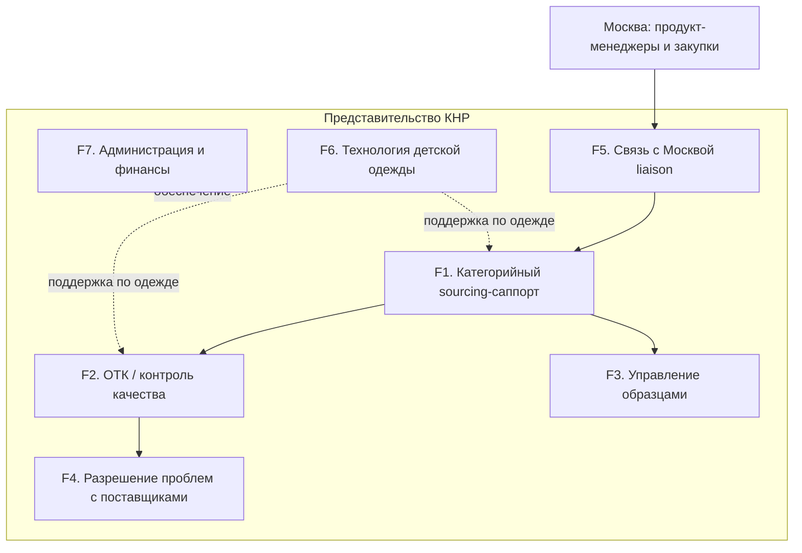

# Функциональная структура представительства «Детского Мира» в КНР

> **Тип документа:** функциональная структура с детальным описанием  
> **Форма присутствия:** Representative Office (RO, 常驻代表机构) — HQ в Шанхае + полевой QC-узел в Гуанчжоу  
> **Горизонт:** первые 6 месяцев с момента запуска  
> **Базовый принцип:** представительство НЕ ведёт выручку и торговлю (Фаза 1); основная миссия — поддержка существующих закупочных процессов «Детского Мира»  
> **Связанные документы:** [02_org_structure.md](02_org_structure.md), [03_budget_6m.md](03_budget_6m.md), [04_setup_development_plan_6m.md](04_setup_development_plan_6m.md), [05_horizontal_interactions_moscow.md](05_horizontal_interactions_moscow.md)

---

## 1. Миссия и принципы

**Миссия:** обеспечить московскому офису «Детского Мира» прямой, контролируемый и быстрый доступ к китайским фабрикам — через сбор образцов, контроль качества на месте, оперативное разрешение проблем с поставщиками и техническую поддержку продукт-менеджеров.

**Принципы работы (Фаза 1):**
- Представительство — **сервисный центр для закупочного блока РФ**, а не самостоятельный коммерческий игрок.
- **Никакой выручки, контрактов на продажу и импорт/экспорт на собственный баланс** — это запрещено правовой формой RO (см. [блок 4 анализа](../detsky_mir_china_research_report.md)). Все контракты заключает головная компания; RO выполняет полевые и контрольные функции.
- **«Глаза и руки» компании в Китае:** физическое присутствие на фабриках вместо удалённой работы через агентов.
- Опора на **локальную команду** (категорийные менеджеры, ОТК, бухгалтер — граждане КНР) при **русском управлении и технадзоре** (директор, технолог).

---

## 2. Карта функциональных блоков

Семь функциональных блоков. Блоки F1–F5 — основная операционная цепочка, F6 — специализированная экспертиза (детская одежда), F7 — обеспечивающая функция.

---

## 3. Детальное описание функций

### F1. Категорийный sourcing-саппорт (одежда, игрушки, аксессуары)

| Параметр | Содержание |
|---|---|
| **Цель** | Поддержка продукт-менеджеров Москвы в работе с заводами: поиск/верификация фабрик, ведение пула поставщиков, сопровождение размещения заказов по своим категориям |
| **Состав работ** | — Верификация фабрик (бизнес-лицензия, мощности, экспортный опыт) — Ведение и актуализация списка одобренных поставщиков (AVL) — Сопровождение переговоров по MOQ, срокам, упаковке (по запросу ПМ) — Сбор коммерческих предложений, спецификаций, прайсов — Мониторинг трендов и новинок (Canton Fair, Yiwu, профильные выставки) |
| **Входы** | Запрос/бриф от ПМ Москвы, спецификация товара, целевая цена |
| **Выходы** | Верифицированный поставщик, КП, спецификация, рекомендация ПМ |
| **Владелец** | Категорийные менеджеры (CN) — по одной на категорию: одежда / игрушки / аксессуары |
| **KPI** | — Время ответа на запрос ПМ ≤ 2 раб. дня — Кол-во новых верифицированных фабрик / квартал — Доля закрытых брифов в срок ≥ 90% |

### F2. ОТК / контроль качества (pre-shipment inspection)

| Параметр | Содержание |
|---|---|
| **Цель** | Проверка качества партии на фабрике **до отгрузки** — главная защитная функция представительства |
| **Состав работ** | — Pre-shipment инспекция по методике **AQL 2.5** (выборочный контроль) — Проверка соответствия спецификации, маркировки, упаковки — Контроль соответствия требованиям GB/CCC и требованиям РФ (EAC/ТР ТС) — Фотофиксация и отчёт об инспекции (PSI report) — Решение «разрешить отгрузку / задержать / переделать» — Промежуточные инспекции (DUPRO) для крупных/проблемных заказов |
| **Входы** | Уведомление о готовности партии, спецификация, утверждённый образец-эталон |
| **Выходы** | PSI-отчёт, вердикт по отгрузке, перечень дефектов |
| **Владелец** | Руководитель ОТК (CN) + инспекторы ОТК (CN), полевая база — Гуанчжоу/Чэнхай |
| **KPI** | — Уровень дефектности отгруженных партий **< 1,5%** — 100% партий по приоритетным SKU проходят PSI — Срок выпуска PSI-отчёта ≤ 1 раб. день после инспекции |

### F3. Управление образцами (sample management)

| Параметр | Содержание |
|---|---|
| **Цель** | Сбор образцов с фабрик и быстрая отправка в Россию для оценки и утверждения ПМ |
| **Состав работ** | — Получение образцов от фабрик, входная проверка — Ведение библиотеки/шоурума образцов в офисе — Маркировка, описание, фотофиксация образцов — Консолидация и отправка партий образцов авиа в Москву — Оформление товаросопроводительных документов на образцы — Хранение эталонных образцов для последующего ОТК |
| **Входы** | Запрос образца от ПМ, образцы от фабрик |
| **Выходы** | Отправленная партия образцов + трекинг, запись в библиотеке образцов |
| **Владелец** | Категорийные менеджеры (CN) + офис-администратор (CN, логистика отправок) |
| **KPI** | — Срок «фабрика → отправка в РФ» **3–7 дней** — 100% образцов с фотофиксацией и описанием — Доля корректно оформленных отправок ≥ 98% |

### F4. Разрешение проблем с поставщиками (брак и задержки)

| Параметр | Содержание |
|---|---|
| **Цель** | Оперативный выезд на фабрику и проверка реального состояния при браке или срыве сроков |
| **Состав работ** | — Выезд на фабрику для проверки фактического статуса производства — Расследование причин брака/задержки (root cause) — Фиксация фактического состояния (фото/видео, акты) — Переговоры по переделке, замене, компенсации, ускорению — Контроль исполнения корректирующих действий (CAPA) — Эскалация в Москву при неразрешимых ситуациях |
| **Входы** | Сигнал о браке/задержке от ПМ Москвы или от ОТК |
| **Выходы** | Акт проверки фабрики, план корректирующих действий, статус-отчёт ПМ |
| **Владелец** | Руководитель ОТК (CN) + профильный категорийный менеджер (CN); технадзор — директор (RU) |
| **KPI** | — Срок выезда на фабрику ≤ 3 раб. дня с момента сигнала — Доля кейсов, разрешённых без эскалации в РФ ≥ 80% — Среднее время закрытия кейса брака |

### F5. Связь с московским офисом (liaison)

| Параметр | Содержание |
|---|---|
| **Цель** | Единое окно взаимодействия представительства с продукт-менеджерами и закупками Москвы |
| **Состав работ** | — Приём, приоритизация и распределение запросов ПМ внутри RO — Регулярная отчётность (еженедельный статус по образцам, QC, кейсам) — Согласование приоритетов и сроков с учётом разницы часовых поясов — Ведение общего трекера задач и базы поставщиков — Подготовка управленческой отчётности для руководства РФ |
| **Входы** | Запросы и приоритеты от Москвы |
| **Выходы** | Распределённые задачи, статус-отчёты, эскалации |
| **Владелец** | Директор представительства (RU) |
| **KPI** | — SLA по первичному ответу на запрос ≤ 1 раб. день — Еженедельный статус-отчёт без срывов — Удовлетворённость ПМ Москвы (внутренний опрос) |

Детали процессов и SLA — в [05_horizontal_interactions_moscow.md](05_horizontal_interactions_moscow.md).

### F6. Технология детской одежды (доп. функция)

| Параметр | Содержание |
|---|---|
| **Цель** | Техническая экспертиза по пошиву детской одежды: повышение качества и технологичности изделий на стороне фабрик |
| **Состав работ** | — Разработка/проверка технических пакетов (tech pack): лекала, посадка, размерная сетка — Контроль конструкции, материалов, фурнитуры, швов — Утверждение pre-production sample (PPS) по одежде — Контроль соответствия GB 31701 (безопасность детской одежды) и требований РФ — Обучение/настройка фабрик под требования «Детского Мира» — Поддержка категорийного менеджера по одежде и ОТК в части технологии |
| **Входы** | Tech pack/дизайн от ПМ одежды Москвы, образцы |
| **Выходы** | Утверждённый PPS, скорректированный tech pack, заключение по технологичности |
| **Владелец** | Технолог по детской одежде (RU) |
| **KPI** | — Доля одобренных с первого раза PPS по одежде — Снижение дефектности по швейным изделиям — Время согласования tech pack |

### F7. Администрация и финансы

| Параметр | Содержание |
|---|---|
| **Цель** | Юридическое, финансовое и хозяйственное обеспечение деятельности RO |
| **Состав работ** | — Бухгалтерский и налоговый учёт RO (метод deemed profit ~10% на расходы) — Расчёты с персоналом, соцстрахование локального штата — Платежи поставщикам услуг, командировочные, аренда — Документооборот, ведение печатей (chops), банковский счёт (SAFE) — Соблюдение требований annual report RO (до 30 июня) — Офисное и визовое обеспечение (Z-визы экспатов) |
| **Входы** | Первичные документы, табели, счета |
| **Выходы** | Отчётность, проведённые платежи, закрытый учёт |
| **Владелец** | Бухгалтер (CN) + офис-администратор (CN); надзор — директор (RU); внешний аудит/налоги — аутсорс-консультант |
| **KPI** | — 0 нарушений по срокам налоговой/годовой отчётности — Закрытие месяца в срок — 0 инцидентов комплаенса |

---

## 4. Матрица «функция → роль» (RACI)

> R — Responsible (исполняет), A — Accountable (отвечает за результат), C — Consulted (консультирует), I — Informed (информируется)

| Функция | Директор (RU) | Кат. менеджеры (CN) | ОТК (CN) | Технолог (RU) | Бухгалтер (CN) | Офис-админ (CN) | ПМ Москва |
|---|---|---|---|---|---|---|---|
| F1. Sourcing-саппорт | A | R | C | C | I | I | C/I |
| F2. ОТК / QC | A | C | R | C (одежда) | I | I | I |
| F3. Образцы | A | R | C | C (одежда) | I | R (логистика) | C/I |
| F4. Брак и задержки | A | C/R | R | C (одежда) | I | I | C/I |
| F5. Связь с Москвой | A/R | C | C | C | I | I | C |
| F6. Технология одежды | A | C | C | R | I | I | C |
| F7. Администрация/финансы | A | I | I | I | R | R | I |

---

## 5. Что НЕ входит в scope (out-of-scope, Фаза 1)

Прямо исключено из деятельности представительства на первые 6 месяцев:

- **Продажи и выручка любого вида** — запрещено правовой формой RO.
- **Заключение контрактов на закупку/импорт/экспорт на собственный баланс** — контракты ведёт головная компания в РФ.
- **Прямые расчёты с фабриками за товар** — платежи идут через головную компанию; RO оперирует только операционным бюджетом.
- **Складирование и таможенное оформление товарных партий** — функция логистики РФ/подрядчиков.
- **B2C / маркетплейс-активности в Китае.**
- **Создание торговой компании (WFOE)** — вынесено в опциональную «Фазу 2» (см. [04_setup_development_plan_6m.md](04_setup_development_plan_6m.md)); в Фазе 1 ведётся только подготовка почвы (оценка целесообразности).

---

## 6. Связь функций с пожеланиями руководства

| Пожелание руководства | Покрывающая функция |
|---|---|
| 1. Сбор и отправка образцов из Китая в Россию | **F3. Управление образцами** |
| 2. Проверка качества на фабрике перед отгрузкой | **F2. ОТК / контроль качества** |
| 3. Работа с поставщиками по браку и задержкам, выезды на фабрику | **F4. Разрешение проблем с поставщиками** |
| 4. Помощь продукт-менеджерам Москвы в работе с заводами | **F1. Sourcing-саппорт** + **F5. Связь с Москвой** |
| 5. (доп.) Технолог по пошиву детской одежды | **F6. Технология детской одежды** |
