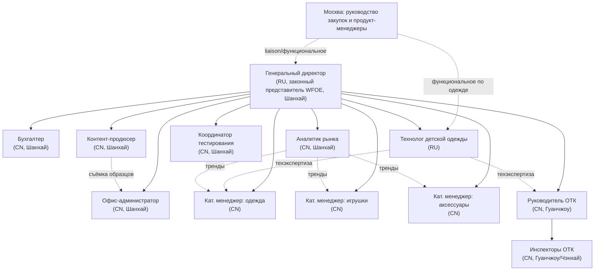

# Организационная структура компании «Детского Мира» в КНР

> **Тип документа:** организационная структура с детальным описанием  
> **Форма присутствия:** **WFOE (торговая компания с правом экспорта)** — HQ в Шанхае + полевой QC-узел в Гуанчжоу  
> **Горизонт:** целевая структура к концу 6 месяцев (найм поэтапный)  
> **Связанные документы:** [01_functional_structure.md](01_functional_structure.md), [03_budget_6m.md](03_budget_6m.md), [04_setup_development_plan_6m.md](04_setup_development_plan_6m.md)

---

## 1. Принцип построения

**Модель: «русское управление + китайская операционная команда».**

- **Русские (экспаты):** директор и технолог — отвечают за управление, технадзор, связь со штаб-квартирой и защиту интересов «Детского Мира».
- **Китайцы (локальный найм):** бухгалтер, категорийные менеджеры, ОТК, контент-продюсер, координатор тестирования, аналитик рынка, офис-администратор — обеспечивают переговоры на родном языке, понимание локального рынка, доступ к фабрикам (гуанси, мяньцзы) и постоянное полевое присутствие.

Обоснование такого распределения:

| Роль | Почему RU / CN |
|---|---|
| Директор — **RU** | Доверенное лицо HQ, законный представитель WFOE, контроль бюджета и комплаенса, прямая коммуникация с руководством РФ, носитель work permit (Z-виза) |
| Технолог — **RU** | Носитель стандартов качества и конструкторских требований «Детского Мира», задаёт планку фабрикам, работает в связке с ПМ одежды Москвы |
| Бухгалтер — **CN** | Знание китайского налогового/трудового права, учёт WFOE, биллинг услуг, банк, печати |
| Категорийные менеджеры — **CN** | Переговоры с фабриками на китайском, знание кластеров и поставщиков, гуанси |
| ОТК — **CN** | Постоянные выезды на фабрики и склады, знание GB-стандартов, мобильность в промкластерах |
| Контент-продюсер — **CN** | Локальное производство фото/видео, знание китайских подрядчиков и студий, мобильность |
| Координатор тестирования — **CN** | Работа с китайскими лабораториями (SGS/BV/Intertek), знание GB и процедур, язык |
| Аналитик рынка — **CN** | Доступ к китайским источникам, маркетплейсам, соцсетям, выставкам; выявление трендов |
| Офис-администратор — **CN** | Хоз. и визовое обеспечение, логистика образцов, документооборот на китайском |

---

## 2. Организационная схема (целевая)

**Сплошные линии** — административное подчинение; **пунктир** — функциональное взаимодействие.

---

## 3. Детальное описание позиций

### 3.1. Генеральный директор (General Manager / законный представитель) — RU

| Параметр | Описание |
|---|---|
| **Подчинение** | Руководству закупочного блока «Детского Мира» (Москва) |
| **В подчинении** | Вся команда компании |
| **Гражданство / тип** | Гражданин РФ, экспат, релокация в Шанхай |
| **Виза** | Z-виза + work permit (legal representative WFOE), 4–6 недель оформления |
| **Зона ответственности** | Общее руководство, бюджет и отчётность WFOE, связь с HQ (F5), сервисные договоры и биллинг материнской компании, приоритизация задач, комплаенс, представление интересов компании, эскалации |
| **Требования** | Опыт закупок/sourcing в Китае, управленческий опыт, английский, базовый китайский — плюс, понимание ВЭД и QC |
| **KPI** | Исполнение бюджета, своевременный биллинг услуг, SLA по запросам Москвы, отсутствие комплаенс-инцидентов, экономия на закупках (косвенно) |

### 3.2. Технолог по детской одежде — RU

| Параметр | Описание |
|---|---|
| **Подчинение** | Административно — директор; функционально — ПМ одежды Москвы |
| **Гражданство / тип** | Гражданин РФ, экспат (или релокант), Z-виза |
| **Зона ответственности** | Tech pack, посадка, конструкция, утверждение PPS по одежде, соответствие GB 31701 и требованиям РФ, обучение фабрик (F6) |
| **Требования** | Технолог/конструктор швейного производства, опыт детской одежды, знание стандартов безопасности, готовность к командировкам на фабрики |
| **KPI** | Доля PPS, одобренных с первого раза; снижение швейного брака; срок согласования tech pack |
| **Примечание** | Нанимается на более позднем этапе 6-месячного горизонта (см. график найма) |

### 3.3. Бухгалтер — CN

| Параметр | Описание |
|---|---|
| **Подчинение** | Директор |
| **Гражданство / тип** | Гражданин КНР, локальный найм, Шанхай |
| **Зона ответственности** | Учёт WFOE (НДС 6% на услуги, CIT 25% на прибыль/наценку), биллинг услуг материнской компании, зарплата и соцстрах, платежи, печати, банк, валютные операции, годовая отчётность и аудит (F7) |
| **Требования** | Опыт бухучёта в КНР (желателен опыт WFOE и трансграничных услуг), знание налогового/трудового права, английский — желателен |
| **KPI** | Своевременность отчётности и биллинга, закрытие месяца, 0 нарушений |
| **Примечание** | На старте часть функций — на аутсорсе (Tricor/Mazars-класс), затем штатный бухгалтер |

### 3.4. Категорийные менеджеры (3 чел.) — CN

| Параметр | Описание |
|---|---|
| **Позиции** | Одежда, Игрушки, Аксессуары — по одному менеджеру на категорию |
| **Подчинение** | Директор; функционально — соответствующие ПМ Москвы |
| **Гражданство / тип** | Граждане КНР, локальный найм |
| **Зона ответственности** | Sourcing-саппорт (F1), сбор и преселекция образцов (F3), сопровождение кейсов брака по своей категории (F4) |
| **Требования** | Опыт sourcing/merchandising в своей категории, знание кластеров (игрушки — Чэнхай/Шаньтоу; одежда — Гуандун/Фуцзянь; аксессуары — Иу), английский рабочий |
| **KPI** | Время ответа ПМ ≤ 2 дня, новые верифицированные фабрики, доля брифов в срок |

### 3.5. Руководитель ОТК — CN

| Параметр | Описание |
|---|---|
| **Подчинение** | Директор |
| **В подчинении** | Инспекторы ОТК |
| **Гражданство / тип** | Гражданин КНР, локальный найм, база — Гуанчжоу (ближе к промкластерам) |
| **Зона ответственности** | Протокол ОТК (AQL 2.5), pre-shipment инспекции (F2), аудиты фабрик/складов/логистики, мониторинг сроков и объёмов поставок, выезды по браку (F4), вердикты по отгрузке, отчётность по качеству |
| **Требования** | Опыт QC/QA в производстве детских товаров, знание GB/CCC, методик инспекции и аудита, управление командой инспекторов |
| **KPI** | Дефектность отгрузок < 1,5%, 100% PSI по приоритетным SKU, срок выезда по браку ≤ 3 дня |

### 3.6. Инспекторы ОТК (1–2 чел.) — CN

| Параметр | Описание |
|---|---|
| **Подчинение** | Руководитель ОТК |
| **Гражданство / тип** | Граждане КНР, локальный найм, мобильная база (Гуанчжоу/Чэнхай) |
| **Зона ответственности** | Полевые инспекции на фабриках и складах, фотофиксация, PSI-отчёты, входной контроль образцов |
| **Требования** | Опыт инспекций, мобильность, знание чек-листов и AQL |
| **KPI** | Кол-во инспекций/мес, качество и срок отчётов |

### 3.7. Контент-продюсер — CN

| Параметр | Описание |
|---|---|
| **Подчинение** | Директор; функционально — маркетинг/контент-команда Москвы |
| **Гражданство / тип** | Гражданин КНР, локальный найм, Шанхай (с выездами) |
| **Зона ответственности** | Производство фото/видеоконтента по товарным категориям, съёмка образцов и новинок, готовность контента к старту продаж (F8) |
| **Требования** | Опыт фото/видеопродакшна (предметная/fashion-съёмка), монтаж, координация подрядчиков/студий, английский рабочий |
| **KPI** | Доля SKU с готовым контентом к старту, срок «образец → контент», объём контента/мес |
| **Примечание** | Нанимается на этапе масштабирования (см. график найма) |

### 3.8. Координатор тестирования — CN

| Параметр | Описание |
|---|---|
| **Подчинение** | Директор; функционально — ОТК и технолог |
| **Гражданство / тип** | Гражданин КНР, локальный найм, Шанхай |
| **Зона ответственности** | Организация тестирования материалов и образцов в аккредитованных лабораториях, подбор методик (ТР ТС/GB), контроль сроков, реестр результатов (F9) |
| **Требования** | Опыт работы с лабораториями (SGS/BV/Intertek), знание стандартов безопасности детских товаров, английский рабочий |
| **KPI** | Срок получения результатов, доля SKU с пройденными обязательными тестами, 0 срывов по обязательным испытаниям |

### 3.9. Аналитик рынка — CN

| Параметр | Описание |
|---|---|
| **Подчинение** | Директор; функционально — категорийный блок Москвы |
| **Гражданство / тип** | Гражданин КНР, локальный найм, Шанхай |
| **Зона ответственности** | Выявление «волн спроса» и трендов в Азии, анализ рынка и новинок, трансляция идей в ассортимент, аналитические обзоры (F10) |
| **Требования** | Опыт рыночной аналитики/категорийного менеджмента, работа с CRM и инструментами аналитики, знание китайских маркетплейсов и соцсетей, английский рабочий |
| **KPI** | Кол-во принятых идей/трендов, сокращение цикла «идея → полка», регулярность обзоров |

### 3.10. Офис-администратор / ассистент — CN

| Параметр | Описание |
|---|---|
| **Подчинение** | Директор |
| **Гражданство / тип** | Гражданин КНР, локальный найм, Шанхай |
| **Зона ответственности** | Документооборот, логистика отправок образцов в РФ (F3), поддержка съёмок контента (F8), визовая поддержка экспатов, офисное обеспечение, помощь бухгалтеру (F7) |
| **Требования** | Административный опыт, английский рабочий, организованность |
| **KPI** | Доля корректно оформленных отправок, своевременность хоз. обеспечения |

---

## 4. Целевая численность и распределение по локациям

| Локация | Роли | Чел. |
|---|---|---|
| **Шанхай (HQ)** | Директор (RU), технолог (RU), бухгалтер (CN), офис-администратор (CN), 3 категорийных менеджера (CN), контент-продюсер (CN), координатор тестирования (CN), аналитик рынка (CN) | 10 |
| **Гуанчжоу (полевой QC-узел)** | Руководитель ОТК (CN) + инспекторы ОТК (CN) | 2–3 |
| **Итого к концу 6 мес.** | | **12–13** |

> Категорийные менеджеры, технолог и контент-продюсер территориально базируются в Шанхае, но проводят значительную часть времени в командировках на фабриках (Гуандун, Фуцзянь, Чжэцзян, Чэнхай). ОТК постоянно базируется ближе к промкластерам юга.

---

## 5. Подчинённость и кросс-функциональные связи

- **Административная вертикаль:** все роли → Генеральный директор → руководство закупок Москвы.
- **Функциональные (пунктирные) связи с Москвой:** категорийные менеджеры работают «по линии» с профильными ПМ; технолог — с ПМ одежды; контент-продюсер — с маркетингом/контентом; аналитик — с категорийным блоком. Эти связи не создают двойного подчинения по найму/бюджету (это зона директора), но определяют операционные приоритеты. Подробно — в [05_horizontal_interactions_moscow.md](05_horizontal_interactions_moscow.md).
- **Технолог ↔ категорийный менеджер одежды ↔ ОТК:** треугольник качества по швейным изделиям (конструкция → закупка → контроль).
- **Аналитик ↔ категорийные менеджеры:** трансляция трендов в активный сорсинг.
- **Контент ↔ образцы (F3):** съёмка идёт с потока преселектированных образцов.

---

## 6. Эволюция структуры (связь с Фазой 2)

Структура спроектирована под WFOE, работающую в Фазе 1 как сервисный центр. Поскольку компания **уже зарегистрирована как торговая с правом экспорта**, переход к Фазе 2 (консолидация закупок, B2B, экспортные операции) не требует смены юр. формы — расширяется только команда: добавляются роли по ВЭД-контрактам, торговому финансовому учёту и логистике. На горизонте первых 6 месяцев торговые операции **не ведутся** — компания оказывает только услуги (см. [04_setup_development_plan_6m.md](04_setup_development_plan_6m.md)).
