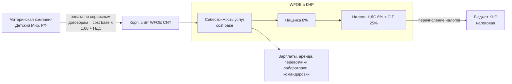

# Бюджет компании «Детского Мира» в КНР — первые 6 месяцев

> **Тип документа:** операционный бюджет и финансовая модель на 6 месяцев  
> **Форма:** **WFOE (торговая компания с правом экспорта)**, в Фазе 1 — сервисный центр без торговли  
> **Валюты:** основная — **CNY (RMB)**; справочно — **RUB**  
> **Курс-ориентир (исходник):** **1 CNY = 12 RUB**  
> **Модель финансирования:** компания финансируется **выручкой по сервисным договорам с материнской компанией** (cost-plus); см. раздел 7  
> **Связанные документы:** [01_functional_structure.md](01_functional_structure.md), [02_org_structure.md](02_org_structure.md), [04_setup_development_plan_6m.md](04_setup_development_plan_6m.md), [06_sample_delivery_scheme_payment.md](06_sample_delivery_scheme_payment.md)  
> **Disclaimer:** зарплатные и операционные ориентиры требуют калибровки HR/Finance; Excel-источник [Бюджет_представительство_КНР_6мес.xlsx](Бюджет_представительство_КНР_6мес.xlsx) подлежит регенерации под новую структуру (10–13 ролей, налоги WFOE).

---

## 1. Сводка

| Блок | CNY | RUB (×12) |
|---|---:|---:|
| **CAPEX (единовременно, старт)** | **254 000** | **3 048 000** |
| **Себестоимость услуг — cost base (6 мес.)** | **1 730 675** | **20 768 100** |
| **Налоги WFOE (НДС 6% + CIT 25% на наценку, 6 мес.)** | **146 761** | **1 761 132** |
| **Выручка по сервисным договорам (билл. материнской компании, 6 мес.)** | **1 869 129** | **22 429 548** |

**Run-rate на 6-й месяц (cost base):** 433 025 CNY/мес → ~5,2 млн CNY/год (~62,4 млн RUB/год).

> Логика: материнская компания оплачивает **выручку по сервисным договорам = себестоимость × (1 + наценка 8%)**. Эта выручка покрывает все расходы WFOE, налоги и оставляет небольшую прибыль. Для материнской компании совокупный денежный отток = выручка + НДС (см. раздел 7).

---

## 2. CAPEX (единовременные затраты старта)

| Статья | CNY | RUB | Комментарий |
|---|---:|---:|---|
| Юридическая регистрация WFOE | 40 000 | 480 000 | Торговая компания с экспортным scope, нотариус/апостиль, 8–12 недель |
| Регистрация ТМ в CNIPA (3 марки) | 10 000 | 120 000 | До начала sourcing (first-to-file) |
| Офис: депозит + ремонт/мебель (~100 м²) | 15 000 | 180 000 | Шанхай Grade A/B |
| IT-капекс (ноутбуки, VPN, ERP-коннектор) | 50 000 | 600 000 | Подключение к системам HQ |
| Стартовые командировки | 86 000 | 1 032 000 | 3–4 поездки (поиск офиса, наём, регистрация) |
| Оборудование ОТК | 10 000 | 120 000 | Полевой набор контроля |
| Контент-оборудование (камера, свет, фон) | 20 000 | 240 000 | Для функции F8 |
| Резерв (contingency ~10%) | 23 000 | 276 000 | — |
| **Итого CAPEX** | **254 000** | **3 048 000** | — |

> **Уставный капитал WFOE:** регистрируется по подписной модели (认缴) — например, эквивалент USD 100–150 тыс., без обязательного внесения «день в день». Рекомендуется фактическая инъекция оборотного капитала на ~3-месячный cost base (см. раздел 9).

---

## 3. Исходники ФОТ

### 3.1. Роли и месячные ставки (gross, CNY/мес)

| Роль | Тип | CNY/мес: зарплата+налоги | Компенсации (жильё/дети) | Релокация (разово) |
|---|---|---:|---:|---:|
| Директор (RU, экспат) | Экспат | 50 000 | 20 000 | 0 |
| Технолог (RU, экспат) | Экспат | 30 000 | 20 000 | 20 000 |
| Кат. менеджеры (3 CN) | Локальный | 18 500 | 0 | 0 |
| Руководитель ОТК (CN) | Локальный | 18 000 | 0 | 0 |
| Аналитик рынка (CN) | Локальный | 16 000 | 0 | 0 |
| Бухгалтер (CN) | Локальный | 16 000 | 0 | 0 |
| Контент-продюсер (CN) | Локальный | 14 000 | 0 | 0 |
| Координатор тестирования (CN) | Локальный | 12 000 | 0 | 0 |
| Инспекторы ОТК (2 CN) | Локальный | 10 000 | 0 | 0 |
| Офис-администратор (CN) | Локальный | 10 000 | 0 | 0 |

### 3.2. Ставки

| Параметр | Значение |
|---|---:|
| Соцвзносы (локальные) | 35% |
| Соцвзносы (экспаты) | 15% |
| НДС на услуги (modern services) | 6% |
| Налог на прибыль (CIT) | 25% (на наценку) |
| Наценка cost-plus | 8% |
| Курс CNY/RUB | 12 |

---

## 4. График найма (по месяцам)

| Роль | M1 | M2 | M3 | M4 | M5 | M6 |
|---|:---:|:---:|:---:|:---:|:---:|:---:|
| Директор (RU) | ● | ● | ● | ● | ● | ● |
| Офис-администратор (CN) | | ● | ● | ● | ● | ● |
| Кат. менеджер — игрушки (CN) | | ● | ● | ● | ● | ● |
| Кат. менеджер — одежда (CN) | | | ● | ● | ● | ● |
| Кат. менеджер — аксессуары (CN) | | | ● | ● | ● | ● |
| Руководитель ОТК (CN) | | | ● | ● | ● | ● |
| Бухгалтер штатный (CN) | | | | ● | ● | ● |
| Инспектор ОТК №1 (CN) | | | | ● | ● | ● |
| Аналитик рынка (CN) | | | | ● | ● | ● |
| Технолог (RU) | | | | | ● | ● |
| Инспектор ОТК №2 (CN) | | | | | ● | ● |
| Контент-продюсер (CN) | | | | | ● | ● |
| Координатор тестирования (CN) | | | | | ● | ● |
| **Активных сотрудников** | **1** | **3** | **6** | **9** | **13** | **13** |

---

## 5. Помесячный cost base — OPEX (CNY)

| Статья | M1 | M2 | M3 | M4 | M5 | M6 | Итого |
|---|---:|---:|---:|---:|---:|---:|---:|
| ФОТ (gross, вкл. релокацию) | 70 000 | 98 500 | 153 500 | 195 500 | 301 500 | 281 500 | 1 100 500 |
| Соцвзносы | 10 500 | 20 475 | 39 725 | 54 425 | 74 525 | 74 525 | 274 175 |
| Аутсорс-бухгалтерия | 8 000 | 8 000 | 8 000 | 0 | 0 | 0 | 24 000 |
| Аренда офиса | 6 000 | 6 000 | 20 000 | 20 000 | 20 000 | 20 000 | 92 000 |
| Командировки и QC-выезды/аудиты | 5 000 | 10 000 | 20 000 | 30 000 | 35 000 | 35 000 | 135 000 |
| IT / связь (opex) | 3 000 | 5 000 | 5 000 | 5 000 | 5 000 | 5 000 | 28 000 |
| Юр./комплаенс-ретейнер | 10 000 | 8 000 | 5 000 | 5 000 | 5 000 | 5 000 | 38 000 |
| Контент-продакшн (расходники/студия) | 0 | 0 | 0 | 0 | 4 000 | 4 000 | 8 000 |
| Координация тестирования (опер.) | 0 | 0 | 0 | 3 000 | 5 000 | 5 000 | 13 000 |
| Прочее (перевод, ресёрч, hospitality) | 3 000 | 3 000 | 3 000 | 3 000 | 3 000 | 3 000 | 18 000 |
| **Cost base / мес** | **115 500** | **158 975** | **254 225** | **315 925** | **453 025** | **433 025** | **1 730 675** |

> Лабораторные счета по F9 (тяжёлые тесты SGS/BV/Intertek) — **pass-through**: перевыставляются материнской компании отдельной строкой и не входят в cost base выше.

---

## 6. Помесячный cost base (RUB, ×12)

| Месяц | M1 | M2 | M3 | M4 | M5 | M6 | Итого |
|---|---:|---:|---:|---:|---:|---:|---:|
| Cost base, RUB | 1 386 000 | 1 907 700 | 3 050 700 | 3 791 100 | 5 436 300 | 5 196 300 | **20 768 100** |

---

## 7. Финансовая модель: сервисные договоры (cost-plus)

**Принцип:** компания (WFOE) не получает «дотацию», а **продаёт услуги материнской компании** по набору сервисных договоров. Цена услуги = себестоимость + наценка 8% (cost-plus / 成本加成 — стандарт для трансфертного ценообразования внутригрупповых услуг в КНР).

### 7.1. Перечень сервисных договоров (billable services)

| Услуга | Функция | База расчёта | Модель оплаты |
|---|---|---|---|
| Поиск и верификация поставщиков (sourcing fee) | F1 | Доля cost base категорийных менеджеров + наценка | Ежемесячный ретейнер / за бриф |
| Контроль качества и аудиты (QC / audit fee) | F2, F4 | Доля cost base ОТК + наценка | За инспекцию/аудит + ретейнер |
| Управление и отправка образцов (sample fee) | F3 | Себестоимость обработки + логистика | За партию / ретейнер |
| Создание контента (content production fee) | F8 | Себестоимость контент-функции + наценка | За SKU / пакет |
| Координация тестирования (lab testing fee) | F9 | Координация + **pass-through счетов лабораторий** | Координация + перевыставление |
| Аналитика рынка (market intelligence retainer) | F10 | Себестоимость аналитика + наценка | Ежемесячный ретейнер |
| Управление и liaison (management fee) | F5, F7 | Доля cost base управления/админа + наценка | Ежемесячный ретейнер |

> Практически удобнее заключить **один рамочный сервисный договор** с приложениями-SOW по каждой услуге и ежемесячными актами, чем 7 отдельных договоров. Биллинг — ежемесячный (акт + инвойс), оплата материнской компанией в CNY.

### 7.2. Расчёт выручки и налогов (CNY)

| Показатель | M1 | M2 | M3 | M4 | M5 | M6 | Итого |
|---|---:|---:|---:|---:|---:|---:|---:|
| Cost base | 115 500 | 158 975 | 254 225 | 315 925 | 453 025 | 433 025 | 1 730 675 |
| Наценка 8% (валовая прибыль) | 9 240 | 12 718 | 20 338 | 25 274 | 36 242 | 34 642 | 138 454 |
| **Выручка по договорам (без НДС)** | **124 740** | **171 693** | **274 563** | **341 199** | **489 267** | **467 667** | **1 869 129** |
| НДС 6% (сверх выручки, платит материнская) | 7 484 | 10 302 | 16 474 | 20 472 | 29 356 | 28 060 | 112 148 |
| CIT 25% (на наценку) | 2 310 | 3 180 | 5 085 | 6 319 | 9 061 | 8 661 | 34 613 |
| **Налоги WFOE всего** | **9 794** | **13 482** | **21 559** | **26 791** | **38 417** | **36 721** | **146 761** |
| Прибыль после CIT | 6 930 | 9 538 | 15 254 | 18 956 | 27 182 | 25 982 | 103 841 |

> **Денежный поток материнской компании (отток за услуги, 6 мес.):** выручка 1 869 129 + НДС 112 148 = **1 981 277 CNY (~23,78 млн RUB)**. НДС WFOE собирает с материнской и перечисляет в бюджет КНР (для иностранной материнской входной НДС, как правило, не зачитывается — учитывается как стоимость).

### 7.3. Схема финансовых потоков

---

## 8. Денежный поток (CAPEX + услуги), CNY

| Месяц | M1 | M2 | M3 | M4 | M5 | M6 | Итого |
|---|---:|---:|---:|---:|---:|---:|---:|
| CAPEX | 150 000 | 70 000 | 14 000 | 10 000 | 5 000 | 5 000 | 254 000 |
| Cost base (OPEX) | 115 500 | 158 975 | 254 225 | 315 925 | 453 025 | 433 025 | 1 730 675 |
| Налоги WFOE | 9 794 | 13 482 | 21 559 | 26 791 | 38 417 | 36 721 | 146 761 |
| **Расходы WFOE / мес** | **275 294** | **242 457** | **289 784** | **352 716** | **496 442** | **474 746** | **2 131 436** |
| Выручка от материнской (без НДС) | 124 740 | 171 693 | 274 563 | 341 199 | 489 267 | 467 667 | 1 869 129 |

> CAPEX концентрируется в M1–M2 (регистрация WFOE, офис, IT, ТМ, контент-оборудование). В первые месяцы выручка от услуг не покрывает CAPEX — разрыв финансируется инъекцией оборотного капитала / уставного капитала от материнской компании.

---

## 9. Допущения, чувствительность и резервы

**Ключевые допущения:**
- Курс **1 CNY = 12 RUB** фиксирован для планирования; фактические расходы — в CNY.
- Наценка cost-plus 8% — ориентир; финальное значение согласуется с трансфертным ценообразованием и подтверждается налоговым консультантом.
- НДС 6% — ставка для современных услуг (现代服务业); возможны льготы/возвраты — уточняется.
- CIT 25% — стандартная ставка; для малых низкоприбыльных предприятий возможны льготы (уточняется).
- Лабораторные тесты — pass-through, в cost base не входят.

**Чувствительность (влияние на итог 6 мес.):**

| Фактор | Изменение | Эффект |
|---|---|---|
| Курс CNY/RUB | +10% (ослабление RUB) | RUB-итог +10% (CNY неизменен) |
| Наценка cost-plus | +2 п.п. (8%→10%) | Выручка/прибыль +~2% к cost base |
| Сдвиг найма на +1 мес. | позже технолог/контент/тестир. | −5…8% к cost base |
| Выбор офиса Grade B вместо A | −25% по аренде | −1…2% к итогу |
| Рост командировочных/аудитов | +30% | +2…3% к итогу |
| Полный штат с M1 | — | +25…30% к 6-мес. cost base |

**Резервы:** держать **3-месячный резерв cost base в CNY** (~CNY 1,2 млн) на корпоративном счёте WFOE — для расчётов с подрядчиками, хеджирования курса и кассовых разрывов до выхода биллинга на ритм.

---

## 10. Связь с экономическим эффектом

В отличие от модели представительства (RO), WFOE-сервисная модель **генерирует выручку и небольшую прибыль в КНР** (cost-plus), что делает компанию финансово прозрачной и готовой к Фазе 2 (экспортные/торговые операции) без смены юр. формы. Основной экономический эффект по-прежнему формируется на стороне материнской компании: контроль качества и аудиты (целевая дефектность < 1,5%), ускорение цикла «идея → образец → контент → полка», снижение брака и возвратов. Количественная оценка экономии подлежит валидации с Finance/Procurement.
