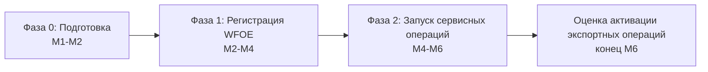

# План создания и развития компании «Детского Мира» в КНР — 6 месяцев

> **Тип документа:** план запуска и развития (с нуля)  
> **Форма:** **WFOE (торговая компания с правом экспорта)** — HQ в Шанхае + полевой QC-узел в Гуанчжоу; в Фазе 1 — только услуги  
> **Горизонт:** M1–M6 (первые полгода с момента старта проекта)  
> **Связанные документы:** [01_functional_structure.md](01_functional_structure.md), [02_org_structure.md](02_org_structure.md), [03_budget_6m.md](03_budget_6m.md), [05_horizontal_interactions_moscow.md](05_horizontal_interactions_moscow.md), [06_sample_delivery_scheme_payment.md](06_sample_delivery_scheme_payment.md)

---

## 1. Фазы запуска

| Фаза | Срок | Ключевой результат |
|---|---|---|
| **Фаза 0. Подготовка** | M1–M2 | Юр. сопровождение, ТМ в CNIPA, поиск офиса, наём директора |
| **Фаза 1. Регистрация WFOE** | M2–M4 | Зарегистрированная WFOE (с экспортным scope), банковский счёт, печати, сервисные договоры, ядро команды |
| **Фаза 2. Запуск сервисных операций** | M4–M6 | Полная команда, протокол ОТК, первые образцы/контент/тесты и аудиты фабрик, биллинг услуг |
| **Оценка активации экспорта** | конец M6 | Решение о начале торговых/экспортных операций (право уже есть в уставе) |

---

## 2. Помесячный roadmap

### Месяц 1 — Старт и подготовка
- Утверждение scope, бюджета и оргструктуры руководством РФ.
- Выбор и наём **директора (RU)**; запуск оформления Z-визы и work permit.
- Выбор внешнего юр./налогового консультанта (Dezan Shira / Tricor-класс).
- Подготовка и нотаризация/апостиль документов головной компании.
- **Подача заявок на регистрацию ТМ в CNIPA** (3 марки) — до начала sourcing.
- Старт поиска офиса в Шанхае (~100 м²) и оценка полевой площадки в Гуанчжоу.
- **Проработка структуры сервисных договоров** (cost-plus) и трансфертного ценообразования с консультантом.
- **Вехи:** scope утверждён; документы parent поданы; ТМ-заявки поданы.

### Месяц 2 — Регистрация WFOE и первый найм
- Pre-approval названия WFOE; подача на business license **с торговым/экспортным scope** (включая внешнеторговую деятельность).
- Наём **офис-администратора (CN)** и **категорийного менеджера по игрушкам (CN)**.
- Аутсорс-бухгалтерия (до штатного бухгалтера).
- Подбор и фиксация офиса (договор аренды, начало ремонта).
- **Подписание рамочного сервисного договора с материнской компанией** (приложения-SOW по услугам).
- Начало составления long-list поставщиков по игрушкам (Чэнхай/Шаньтоу).
- **Вехи:** название одобрено; команда — 3 человека; офис законтрактован; сервисный договор подписан.

### Месяц 3 — Юр. оформление и расширение команды
- Получение business license; изготовление печатей (chops).
- Открытие корпоративного банковского счёта (Bank of China / ICBC), настройка валютных операций.
- Налоговая регистрация WFOE (НДС, CIT), регистрация как плательщика НДС.
- **Регистрация участника ВЭД и таможенная регистрация (export/import) — «про запас»** (право оформляется, но в Фазе 1 не используется).
- Наём **категорийных менеджеров по одежде и аксессуарам (CN)** и **руководителя ОТК (CN)**.
- Разработка и утверждение **протокола ОТК (AQL 2.5)** и чек-листов инспекций/аудитов.
- Подключение к системам HQ (ERP-коннектор, общий трекер задач).
- **Вехи:** WFOE юридически действует; счёт открыт; экспортная лицензия оформлена; команда — 6 человек; протокол ОТК готов.

### Месяц 4 — Операционный запуск услуг
- Наём **штатного бухгалтера (CN)**, **инспектора ОТК №1 (CN)** и **аналитика рынка (CN)**.
- Первые **отправки образцов** в Москву по налаженному процессу (F3).
- Первые **pre-shipment инспекции** на фабриках (F2) и старт **аудитов фабрик/складов**.
- Запуск **первого биллинга услуг** материнской компании (акт + инвойс).
- Запуск регулярной отчётности перед ПМ Москвы (еженедельный статус).
- **Вехи:** первые PSI-отчёты; первые партии образцов отправлены; первый акт по сервисному договору выставлен; 9 человек в штате.

### Месяц 5 — Технология, контент, тестирование, масштабирование
- Наём **технолога (RU)**, **инспектора ОТК №2 (CN)**, **контент-продюсера (CN)** и **координатора тестирования (CN)**.
- Запуск функции **F6 (технология одежды):** tech pack, утверждение PPS с привлечением ЦО.
- Запуск **F8 (контент):** первые фото/видео по SKU.
- Запуск **F9 (тестирование):** первые тесты материалов/образцов в лабораториях.
- Расширение пула одобренных поставщиков (AVL) по всем 3 категориям.
- Отработка процесса **эскалации брака/задержек** (F4) на реальных кейсах.
- **Вехи:** полная команда (13 человек); первый PPS по одежде утверждён; первый контент и первые протоколы тестов готовы.

### Месяц 6 — Выход на штатный режим и оценка
- Стабильный поток: образцы, контент, тесты, PSI, аудиты, выезды по проблемам — в рабочем ритме.
- Достижение целевых KPI (см. раздел 4).
- Ретроспектива первых 6 месяцев, сверка экономии с Finance/Procurement, проверка трансфертного ценообразования.
- **Подготовка обоснования по активации экспортных/торговых операций** (Фаза 2) — go/no-go материалы (юр. форма уже позволяет).
- **Вехи:** KPI на целевом уровне; отчёт руководству + рекомендация по активации экспорта.

---

## 3. Сводная таблица вех

| # | Веха | Срок |
|---|---|---|
| 1 | Scope/бюджет утверждены, директор нанят | M1 |
| 2 | ТМ поданы в CNIPA | M1 |
| 3 | Название WFOE одобрено, офис законтрактован, сервисный договор подписан | M2 |
| 4 | Business license (торговый/экспортный scope) + печати | M3 |
| 5 | Корпоративный счёт открыт, налоговая регистрация | M3 |
| 6 | Экспортная/таможенная регистрация оформлена («про запас») | M3 |
| 7 | Протокол ОТК утверждён | M3 |
| 8 | Первые отправки образцов в РФ + первый биллинг услуг | M4 |
| 9 | Первые pre-shipment инспекции и аудиты | M4 |
| 10 | Технолог/контент/тестирование запущены | M5 |
| 11 | Полная команда (13 чел.) | M5 |
| 12 | KPI на целевом уровне | M6 |
| 13 | Go/No-Go материалы по активации экспорта (Фаза 2) | M6 |

---

## 4. KPI по месяцам

| KPI | M1–M2 | M3–M4 | M5–M6 |
|---|---|---|---|
| Численность команды | 1→3 | 6→9 | 13 |
| Верифицированных фабрик (накопит.) | 0 | 10–15 | 25–40 |
| Партий образцов отправлено в РФ | 0 | первые | регулярный поток |
| Pre-shipment инспекций и аудитов / мес | 0 | первые | по приоритетным SKU |
| Контент по SKU / тесты | 0 | 0 | первые партии |
| Уровень дефектности отгрузок | — | базлайн | < 1,5% (цель) |
| Срок «образец → отправка в РФ» | — | отладка | 3–7 дней |
| Биллинг услуг материнской (акты) | — | первый | ежемесячно |
| SLA ответа ПМ Москвы | — | ≤ 2 дня | ≤ 1 день |

---

## 5. График найма

| Роль | Месяц выхода |
|---|---|
| Директор (RU) | M1 |
| Офис-администратор (CN) | M2 |
| Кат. менеджер — игрушки (CN) | M2 |
| Кат. менеджер — одежда (CN) | M3 |
| Кат. менеджер — аксессуары (CN) | M3 |
| Руководитель ОТК (CN) | M3 |
| Бухгалтер штатный (CN) | M4 |
| Инспектор ОТК №1 (CN) | M4 |
| Аналитик рынка (CN) | M4 |
| Технолог (RU) | M5 |
| Инспектор ОТК №2 (CN) | M5 |
| Контент-продюсер (CN) | M5 |
| Координатор тестирования (CN) | M5 |

> Поэтапность снижает финансовую нагрузку первых месяцев и синхронизирует найм с реальной готовностью функций (сначала регистрация и sourcing, затем ОТК и аналитика, затем технология/контент/тестирование). Детализация затрат — в [03_budget_6m.md](03_budget_6m.md).

---

## 6. Риски запуска и митигация

| Риск | Митигация |
|---|---|
| Задержка Z-визы директора | Ранний старт оформления (M1); сопровождение HR-агентством |
| Срыв сроков регистрации WFOE (дольше, чем RO) | Внешний юр. консультант с опытом WFOE; буфер в сроках; параллельные шаги |
| Налоговые риски трансфертного ценообразования | Согласовать наценку cost-plus и документацию TP с консультантом заранее (M1–M2) |
| Кража ИС / копирование | Регистрация ТМ в CNIPA **до** визитов на фабрики; NDA с поставщиками |
| Сложность открытия счёта (санкционный контекст) | Bank of China / ICBC; расчёты в CNY; due diligence заранее |
| Курсовые колебания CNY/RUB | 3-месячный резерв cost base в CNY; форварды |
| Найм квалифицированного ОТК/технолога/контента | Конкурентные пакеты; начать поиск заранее (M2–M3) |

Полная карта рисков — в [блоке 8 исходного анализа](../detsky_mir_china_research_report.md).

---

## 7. Критерии активации Фазы 2 (экспортные/торговые операции)

Поскольку WFOE **уже зарегистрирована как торговая компания с правом экспорта**, Фаза 2 не требует смены юр. формы — это лишь **активация торговых операций**. Решение принимается **в конце M6** при выполнении условий:

- [ ] WFOE стабильно выполняет сервисные функции (KPI на целевом уровне), биллинг услуг отлажен.
- [ ] Подтверждена и измерена экономия на закупках (валидация Finance/Procurement).
- [ ] Есть бизнес-кейс под торговые операции, требующие выручки/экспорта на стороне Китая (консолидация закупок, B2B).
- [ ] Готовность Finance к товарным CNY-расчётам и торговому учёту WFOE.
- [ ] Положительная оценка санкционного/правового риска.

> На горизонте первых 6 месяцев торговые/экспортные операции **не ведутся** — компания оказывает только услуги по сервисным договорам. Это соответствует позиции руководства: приоритет — поддержка существующих закупочных процессов.
