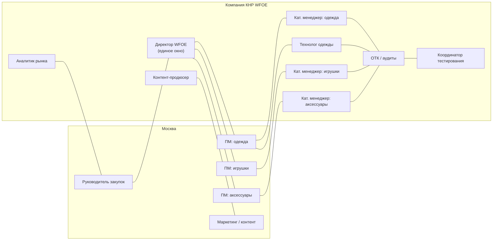
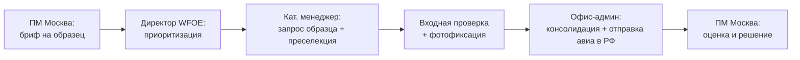
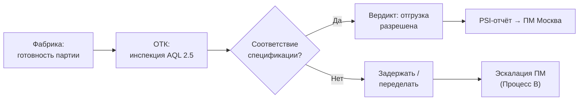
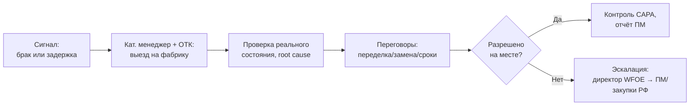
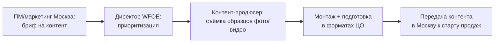
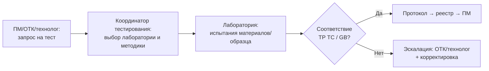
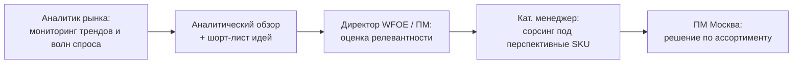

# Горизонтальные взаимодействия компании КНР с продукт-менеджерами московского офиса

> **Тип документа:** структура горизонтальных взаимодействий и сквозных процессов  
> **Участники:** компания в КНР (**WFOE**, Шанхай/Гуанчжоу) ↔ продукт-менеджеры и закупки (Москва)  
> **Связанные документы:** [01_functional_structure.md](01_functional_structure.md), [02_org_structure.md](02_org_structure.md), [03_budget_6m.md](03_budget_6m.md), [04_setup_development_plan_6m.md](04_setup_development_plan_6m.md), [06_sample_delivery_scheme_payment.md](06_sample_delivery_scheme_payment.md)

---

## 1. Принцип взаимодействия

Компания и московский офис связаны **функционально (горизонтально)**, без двойного административного подчинения: наём, бюджет и дисциплина — зона директора WFOE; операционные приоритеты и контент задач — зона продукт-менеджеров Москвы.

- **Единое окно:** все запросы из Москвы проходят через директора WFOE (функция F5 — liaison), который приоритизирует и распределяет их внутри команды.
- **Прямые рабочие связки** (после приоритизации): категорийный менеджер ↔ профильный ПМ; технолог ↔ ПМ одежды; контент-продюсер ↔ маркетинг/контент Москвы; аналитик ↔ категорийный блок.
- **Сервисная природа взаимодействий:** каждая услуга (sourcing, QC/аудит, образцы, контент, тестирование, аналитика) оказывается по **рамочному сервисному договору** (cost-plus) и фиксируется ежемесячным актом — см. финансовую модель в [03_budget_6m.md](03_budget_6m.md).
- **Общий инструментарий:** единый трекер задач + база поставщиков (AVL) + библиотека образцов + хранилище контента и протоколов тестов, доступные обеим сторонам.

---

## 2. Карта взаимодействий

---

## 3. Сквозные процессы (end-to-end)

### Процесс А. Запрос и отправка образца

| Параметр | Значение |
|---|---|
| Инициатор | ПМ Москвы |
| Исполнители WFOE | Категорийный менеджер + офис-администратор |
| Целевой срок | 3–7 дней «фабрика → отправка в РФ» |
| Артефакты | Карточка образца (фото, описание), трек-номер отправки |
| Сервисный договор | «sample management & shipping fee» (см. [06_sample_delivery_scheme_payment.md](06_sample_delivery_scheme_payment.md)) |

### Процесс Б. Pre-shipment контроль качества перед отгрузкой

| Параметр | Значение |
|---|---|
| Инициатор | Уведомление фабрики о готовности / план отгрузок |
| Исполнители WFOE | ОТК (руководитель + инспекторы); по одежде — с технологом |
| Целевой срок | PSI-отчёт ≤ 1 раб. день после инспекции |
| Артефакты | PSI-отчёт, фотоматериалы, вердикт по отгрузке |
| Сервисный договор | «QC / inspection / audit fee» |

### Процесс В. Эскалация брака / задержки

| Параметр | Значение |
|---|---|
| Инициатор | ПМ Москвы или ОТК |
| Исполнители WFOE | Категорийный менеджер + ОТК; технадзор — директор |
| Целевой срок | Выезд на фабрику ≤ 3 раб. дня с момента сигнала |
| Артефакты | Акт проверки фабрики, план CAPA, статус-отчёт |

### Процесс Г. Технологическая поддержка по детской одежде

| Параметр | Значение |
|---|---|
| Инициатор | ПМ одежды Москвы |
| Исполнители WFOE | Технолог; во взаимодействии с кат. менеджером одежды и ОТК |
| Целевой срок | Согласование tech pack / PPS по регламенту проекта |
| Артефакты | Утверждённый PPS, скорректированный tech pack, эталонный образец |

### Процесс Д. Создание контента

| Параметр | Значение |
|---|---|
| Инициатор | ПМ / маркетинг Москвы |
| Исполнители WFOE | Контент-продюсер + офис-администратор |
| Целевой срок | Готовность контента к старту продаж (в т.ч. ТНП — до поступления партии на РЦ) |
| Артефакты | Фото/видео по SKU, переданные в Москву |
| Сервисный договор | «content production fee» |

### Процесс Е. Тестирование материалов и образцов

| Параметр | Значение |
|---|---|
| Инициатор | ПМ / ОТК / технолог |
| Исполнители WFOE | Координатор тестирования + ОТК/технолог |
| Целевой срок | По регламенту лаборатории; оперативное получение протоколов |
| Артефакты | Протоколы испытаний, заключение, запись в реестре |
| Сервисный договор | «lab testing coordination fee» + pass-through счетов лабораторий |

### Процесс Ж. Анализ рынка и трендов

| Параметр | Значение |
|---|---|
| Инициатор | Аналитик рынка (проактивно) / запрос ПМ |
| Исполнители WFOE | Аналитик рынка + категорийные менеджеры |
| Целевой срок | Регулярные обзоры (например, раз в 2 недели) |
| Артефакты | Аналитический обзор, шорт-лист трендовых SKU, рекомендации |
| Сервисный договор | «market intelligence retainer» |

---

## 4. SLA и каналы

| Параметр | Значение |
|---|---|
| Первичный ответ на запрос ПМ | ≤ 1 раб. день |
| Закрытие брифа на образец | 3–7 дней |
| Выезд на фабрику по браку/задержке | ≤ 3 раб. дня |
| PSI-отчёт после инспекции | ≤ 1 раб. день |
| Готовность контента | к старту продаж по SKU |
| Получение протоколов тестов | по регламенту лаборатории, без срывов обязательных |
| Аналитические обзоры | регулярно (раз в 2 недели) |
| Биллинг услуг материнской компании | ежемесячно (акт + инвойс) |
| Еженедельный статус-отчёт | каждую неделю (образцы, QC, контент, тесты, кейсы) |
| Рабочее окно пересечения | МСК и Шанхай: разница **+5 ч** (зима) — общее окно ~11:00–18:00 МСК / 16:00–23:00 CN; критичные вопросы — в первой половине дня МСК |
| Каналы | Общий трекер задач (единый бэклог), корпоративная почта, мессенджер для оперативной связи, видеозвонки для эскалаций |
| Язык | Внутри WFOE — китайский/английский; с Москвой — русский (директор, технолог) / английский (кат. менеджеры) |

---

## 5. RACI по сквозным процессам

> R — исполняет, A — отвечает за результат, C — консультирует, I — информируется

| Процесс | Директор WFOE | Кат. менеджер | ОТК | Технолог | Контент | Тестир. | Аналитик | ПМ Москва | Закупки РФ |
|---|---|---|---|---|---|---|---|---|---|
| А. Образцы | A | R | C | C (одежда) | C | C | I | C/I | I |
| Б. Pre-shipment QC | A | C | R | C (одежда) | I | C | I | I | I |
| В. Брак / задержки | A | R | R | C (одежда) | I | C | I | C | C/I |
| Г. Технология одежды | A | C | C | R | I | C | I | C | I |
| Д. Контент | A | C | I | I | R | I | C | C | I |
| Е. Тестирование | A | C | C | C (одежда) | I | R | I | C/I | I |
| Ж. Анализ рынка | A | C | I | I | I | I | R | C | C/I |

---

## 6. Точки эскалации

| Уровень | Когда | Кто решает |
|---|---|---|
| L1 — операционный | Рабочие вопросы по образцу/инспекции/контенту/тесту | Категорийный менеджер / профильный исполнитель ↔ ПМ |
| L2 — функциональный | Спор по качеству, срокам, переделке, методике теста | Руководитель ОТК / технолог / координатор тестирования ↔ ПМ |
| L3 — управленческий | Неразрешимый кейс, риск срыва поставки, смена поставщика | Директор WFOE ↔ руководитель закупок Москвы |
| L4 — стратегический | Системные проблемы поставщика, юр./комплаенс-риски | Директор WFOE + руководство закупок «Детского Мира» |

---

## 7. Принципы здоровых горизонтальных связей

- **Один вход, одна приоритизация:** Москва не «дёргает» исполнителей напрямую в обход приоритетов — распределение идёт через директора WFOE, что исключает перегрузку и конфликты приоритетов.
- **Прозрачность:** все запросы, статусы и решения фиксируются в общем трекере — обе стороны видят актуальную картину.
- **Уважение к часовым поясам:** критичные задачи ставятся с учётом окна пересечения; асинхронные — с чётким дедлайном.
- **Документируемость:** каждый PSI, акт проверки, протокол теста, единица контента и утверждение PPS оформляется артефактом — основа для актов по сервисным договорам, разрешения споров и накопления базы знаний по поставщикам.
