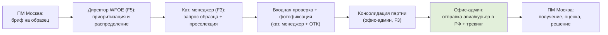
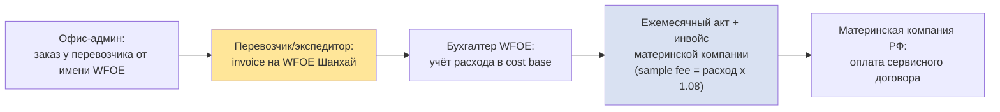

# Схема доставки образцов и контур оплаты (Фаза 1)

> **Тип документа:** схема end-to-end процесса доставки образцов + оплата/закрывающие документы  
> **Форма присутствия:** **WFOE (торговая компания с правом экспорта)** — Шанхай + полевой QC-узел в Гуанчжоу; в Фазе 1 — только услуги  
> **Горизонт:** первые 6 месяцев (Фаза 1)  
> **Ключевой принцип:** WFOE оплачивает доставку образцов из своих средств (перевозчику — invoice на WFOE), а затем **перевыставляет эти расходы материнской компании в составе сервисного договора** «sample management & shipping fee» (cost-plus).  
> **Связанные документы:** [01_functional_structure.md](01_functional_structure.md) (F3, F5), [05_horizontal_interactions_moscow.md](05_horizontal_interactions_moscow.md) (Процесс А), [03_budget_6m.md](03_budget_6m.md) (финансовая модель сервисных договоров)

---

## 1. Предпосылки и границы

- **WFOE в Фазе 1 не торгует и не экспортирует товар** — все расчёты с фабриками за продукцию идут через головную компанию в РФ. Отправка образцов идёт как **сервис**, а не как товарный экспорт.
- **Доставка образцов** — сервисная функция F3. WFOE оплачивает перевозчика, расход входит в cost base и **перевыставляется материнской компании** с наценкой 8% по сервисному договору.
- **Оплата перевозчику:** WFOE размещает заказ у перевозчика/экспедитора, получает invoice на себя, учитывает расход и предъявляет его в ежемесячном акте материнской компании.
- **Исключено из scope WFOE (Фаза 1):** складирование и таможенное оформление товарных партий, прямые платежи фабрикам за товар.

---

## 2. Процесс доставки образцов (end-to-end)

| Параметр | Значение |
|---|---|
| **Инициатор** | ПМ Москвы |
| **Исполнители WFOE** | Категорийный менеджер + офис-администратор (преселекция, консолидация, логистика) |
| **Целевой срок** | 3–7 дней «фабрика → отправка в РФ» |
| **Артефакты** | Карточка образца (фото, описание), трек-номер, подтверждение отправки |
| **KPI** | Доля корректно оформленных отправок ≥ 98% |

> Подробное описание шагов и RACI — в [05_horizontal_interactions_moscow.md](05_horizontal_interactions_moscow.md) (Процесс А) и [01_functional_structure.md](01_functional_structure.md) (F3, матрица RACI).

---

## 3. Контур оплаты и биллинга (cost-plus)

| Этап | Кто делает | Документ | Комментарий |
|---|---|---|---|
| Размещение заказа | Офис-админ (логистика) | Заявка/booking | От имени WFOE |
| Выставление счёта перевозчиком | Перевозчик | Invoice на WFOE | Шанхайский адрес WFOE |
| Учёт расхода | Бухгалтер WFOE | Проводка в cost base | Входит в себестоимость месяца |
| Биллинг материнской | Бухгалтер + директор | Акт + инвойс (sample fee) | Расход + наценка 8% + НДС 6% |
| Оплата | Материнская компания РФ | Платёж в CNY | Выручка WFOE по сервисному договору |

> Расходы на доставку образцов — часть cost base WFOE (см. [03_budget_6m.md](03_budget_6m.md), строки «Командировки/QC» и сервисный договор «sample management & shipping fee»). С наценкой 8% они возвращаются как выручка; экономический эффект формируется на стороне материнской компании через ускорение time-to-market и снижение брака.

---

## 4. Артефакты и документы по отправке

- Карточка образца (фото, описание, спецификация, источник)
- Трек-номер и подтверждение отправки (AWB / tracking)
- Invoice и акт от перевозчика (на WFOE)
- Ежемесячный акт + инвойс материнской компании по «sample fee»
- Подтверждение получения в Москве (опционально, для закрытия)
- Запись в библиотеке образцов WFOE

---

## 5. SLA и точки эскалации

- Первичный ответ на бриф ПМ — ≤ 1 раб. день (директор WFOE)
- Срок «фабрика → отправка» — 3–7 дней
- Биллинг материнской компании — ежемесячно (акт + инвойс)
- При срыве сроков или проблемах с перевозчиком — эскалация директору WFOE → закупки Москвы (L3)

---

*Документ соответствует принципам Фазы 1: WFOE оказывает услуги закупочному блоку РФ по сервисным договорам (cost-plus) и не ведёт торговлю/экспорт товара.*
