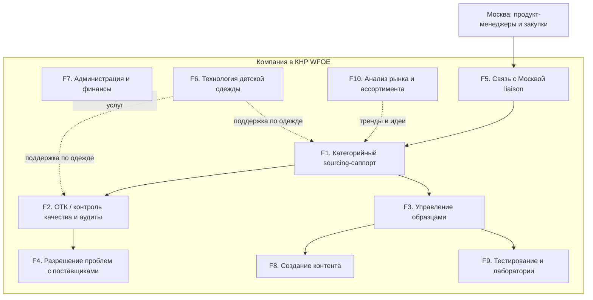
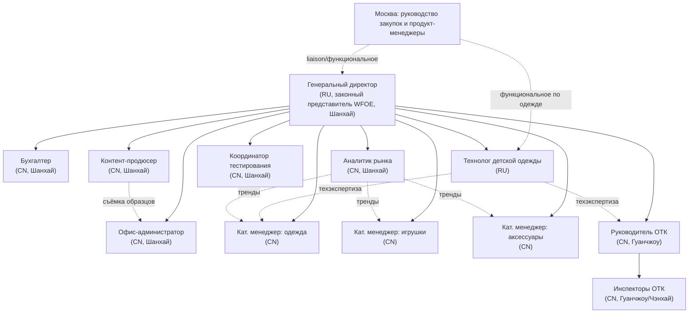
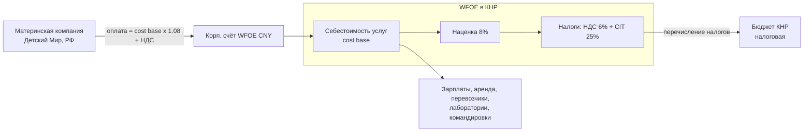
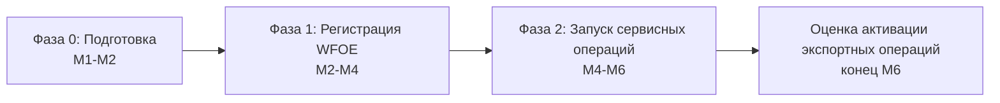
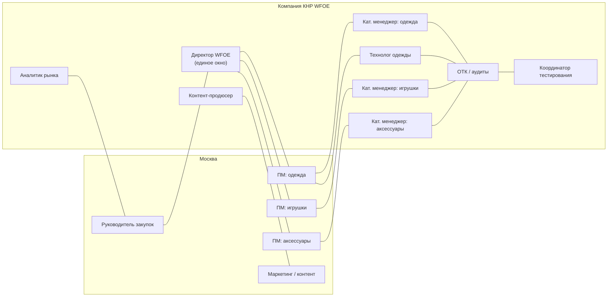
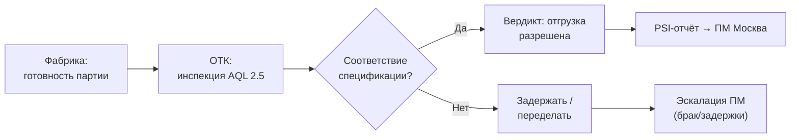

# Блок-схемы презентации WFOE «Детский Мир» в КНР

> **Назначение:** все диаграммы дека в одном файле — для просмотра (Cursor / GitHub / Confluence рендерят mermaid автоматически), для ручной вставки в PowerPoint и как источник для `build_pptx.py`.  
> **Связанные файлы:** [slides.md](./slides.md) · [build-spec.md](./build-spec.md) · исходники `.mmd` в [_assets/diagrams/](./_assets/diagrams/)

В сгенерированном `DetMir_China_WFOE_Phase1.pptx` диаграммы могут отсутствовать, если при сборке не были отрендерены PNG (нужен Node.js + `npx @mermaid-js/mermaid-cli`). **Этот файл — полный комплект схем**; откройте его в редакторе с поддержкой Mermaid или экспортируйте блоки в PNG через [Mermaid Live Editor](https://mermaid.live/).

---

## Оглавление

| # | diagram_id | Слайд | Заголовок на слайде | Файл `.mmd` |
|---:|---|---:|---|---|
| 1 | `func-blocks` | 4 | Карта функциональных блоков | [diagram-01-func-blocks.mmd](./_assets/diagrams/diagram-01-func-blocks.mmd) |
| 2 | `org-structure` | 6 | Организационная структура | [diagram-02-org-structure.mmd](./_assets/diagrams/diagram-02-org-structure.mmd) |
| 3 | `budget-flow` | 9 | Финансовая модель cost-plus | [diagram-03-budget-flow.mmd](./_assets/diagrams/diagram-03-budget-flow.mmd) |
| 4 | `roadmap-phases` | 11 | Roadmap запуска (фазы) | [diagram-04-roadmap-phases.mmd](./_assets/diagrams/diagram-04-roadmap-phases.mmd) |
| 5 | `moscow-links` | 13 | Горизонтальные связи с Москвой | [diagram-05-moscow-links.mmd](./_assets/diagrams/diagram-05-moscow-links.mmd) |
| 6 | `process-samples` | 14 | Процесс А — образцы | [diagram-06-process-samples.mmd](./_assets/diagrams/diagram-06-process-samples.mmd) |
| 7 | `process-qc` | 14 | Процесс Б — pre-shipment QC | [diagram-07-process-qc.mmd](./_assets/diagrams/diagram-07-process-qc.mmd) |
| 8 | `sample-payment` | 14 | Контур оплаты доставки образцов | [diagram-08-sample-payment.mmd](./_assets/diagrams/diagram-08-sample-payment.mmd) |

---

## Диаграмма 1 — Карта функциональных блоков F1–F10

**Слайд:** 4 · **diagram_id:** `func-blocks`  
**Источник исследования:** [01_functional_structure.md](../01_functional_structure.md), раздел 2

**Что показывает:** десять функциональных блоков WFOE и потоки между ними. Москва (ПМ и закупки) → F5 (liaison) → F1 (sourcing) → F2/F3 → F4/F8/F9. Пунктир — поддерживающие связи F6, F7, F10.

**Условные обозначения:**

| Элемент | Значение |
|---|---|
| Сплошная стрелка | Основная операционная цепочка |
| Пунктир | Функциональная / поддерживающая связь |
| F1–F5 | Операционное ядро |
| F6 | Технология детской одежды |
| F7 | Администрация, учёт, биллинг |
| F8–F10 | Контент, лаборатории, аналитика рынка |



---

## Диаграмма 2 — Организационная структура (целевая, к M6)

**Слайд:** 6 · **diagram_id:** `org-structure`  
**Источник:** [02_org_structure.md](../02_org_structure.md), раздел 2

**Что показывает:** административное подчинение (сплошные линии → директор WFOE) и функциональные связи с Москвой и внутри команды (пунктир). HQ Шанхай + QC-узел Гуанчжоу.

**Условные обозначения:**

| Линия | Значение |
|---|---|
| `-->` сплошная | Административное подчинение |
| `-.->` пунктир | Функциональное взаимодействие (без двойного подчинения по найму) |
| RU | Директор, технолог (экспаты) |
| CN | Операционный штат |



---

## Диаграмма 3 — Финансовая модель: потоки cost-plus

**Слайд:** 9 · **diagram_id:** `budget-flow`  
**Источник:** [03_budget_6m.md](../03_budget_6m.md), раздел 7.3

**Что показывает:** как материнская компания оплачивает услуги WFOE (cost base × 1,08 + НДС 6%), как средства распределяются на себестоимость, наценку, налоги и поставщиков (ФОТ, аренда, логистика).

**Ключевые цифры (6 мес., ориентир):**

| Показатель | CNY |
|---|---:|
| Cost base | 1 730 675 |
| Наценка 8% | 138 454 |
| Выручка (без НДС) | 1 869 129 |
| НДС 6% (сверх) | 112 148 |
| Отток материнской (выручка + НДС) | 1 981 277 |



---

## Диаграмма 4 — Фазы запуска (roadmap)

**Слайд:** 11 · **diagram_id:** `roadmap-phases`  
**Источник:** [04_setup_development_plan_6m.md](../04_setup_development_plan_6m.md), раздел 1

**Что показывает:** четыре фазы от подготовки до решения об активации экспорта в конце M6. «Фаза 2» на схеме — **запуск сервисных операций** (M4–M6), не путать с торговой Фазой 2 (экспорт).

| Фаза | Срок | Результат |
|---|---|---|
| Фаза 0. Подготовка | M1–M2 | Юр. сопровождение, ТМ, директор |
| Фаза 1. Регистрация WFOE | M2–M4 | License, счёт, ядро команды |
| Фаза 2. Сервисные операции | M4–M6 | Полная команда, PSI, биллинг |
| Оценка экспорта | конец M6 | Go/no-go торговых операций |



---

## Диаграмма 5 — Горизонтальные связи Москва ↔ WFOE

**Слайд:** 13 · **diagram_id:** `moscow-links`  
**Источник:** [05_horizontal_interactions_moscow.md](../05_horizontal_interactions_moscow.md), раздел 2

**Что показывает:** кто с кем взаимодействует функционально. Директор — единое окно для закупок и всех ПМ; кат. менеджеры связаны с профильными ПМ; технолог — с ПМ одежды; ОТК — с кат. менеджерами и технологом.

**Принцип:** линии `---` — рабочие связки после приоритизации через директора; не создают второго административного подчинения.



---

## Диаграмма 6 — Процесс А: запрос и отправка образца

**Слайд:** 14 (верх, слева) · **diagram_id:** `process-samples`  
**Источник:** [05_horizontal_interactions_moscow.md](../05_horizontal_interactions_moscow.md), процесс А; [06_sample_delivery_scheme_payment.md](../06_sample_delivery_scheme_payment.md)

**Что показывает:** end-to-end цепочку от брифа ПМ до оценки образца в Москве.

| Параметр | Значение |
|---|---|
| Инициатор | ПМ Москвы |
| Исполнители WFOE | Кат. менеджер + офис-администратор |
| Целевой срок | **3–7 дней** «фабрика → отправка в РФ» |
| Сервисный договор | sample management & shipping fee |


---

## Диаграмма 7 — Процесс Б: pre-shipment контроль качества

**Слайд:** 14 (верх, справа) · **diagram_id:** `process-qc`  
**Источник:** [05_horizontal_interactions_moscow.md](../05_horizontal_interactions_moscow.md), процесс Б

**Что показывает:** инспекция AQL 2,5 на фабрике, ветвление «разрешить / задержать», эскалация при браке, PSI-отчёт в Москву.

| Параметр | Значение |
|---|---|
| Методика | AQL 2,5 (pre-shipment) |
| PSI-отчёт | ≤ **1 раб. день** после инспекции |
| Целевая дефектность отгрузок | **< 1,5%** |



---

## Диаграмма 8 — Контур оплаты доставки образцов (cost-plus)

**Слайд:** 14 (низ) · **diagram_id:** `sample-payment`  
**Источник:** [06_sample_delivery_scheme_payment.md](../06_sample_delivery_scheme_payment.md), раздел 3

**Что показывает:** WFOE платит перевозчику → расход в cost base → ежемесячный акт материнской компании (sample fee × 1,08 + НДС). Не товарный экспорт, а сервис.

| Этап | Документ |
|---|---|
| Заказ | Booking от имени WFOE |
| Расход | Invoice перевозчика на WFOE |
| Биллинг | Акт + инвойс sample fee материнской |
| Оплата | Платёж материнской в CNY |


---

## Как вставить диаграммы в PowerPoint

### Вариант A — пересборка PPTX (рекомендуется)

1. Установите [Node.js LTS](https://nodejs.org/) (в PATH должны быть `node` и `npx`).
2. Из папки `presentation/`:

```powershell
py -3 -m pip install -r requirements.txt
py -3 build_pptx.py
```

PNG появятся в `_assets/diagrams/` рядом с `.mmd` и встроятся в слайды 4, 6, 9, 11, 13, 14.

### Вариант B — вручную из этого файла

1. Откройте нужный блок mermaid в [Mermaid Live Editor](https://mermaid.live/) (скопируйте код из раздела выше).
2. Экспортируйте **PNG** или **SVG**.
3. В PowerPoint: **Вставка → Рисунки** на соответствующий слайд (см. таблицу «Оглавление»).

### Вариант C — приложение к презентации

Распечатайте или отправьте **`diagrams.md`** (или PDF из него) как **приложение** к основному деку — все схемы с подписями и таблицами параметров.

---

## Карта «слайд → диаграмма»

| Слайд PPTX | Диаграммы на слайде |
|---:|---|
| 4 | Диаграмма 1 (func-blocks) |
| 6 | Диаграмма 2 (org-structure) |
| 9 | Диаграмма 3 (budget-flow) |
| 11 | Диаграмма 4 (roadmap-phases) + таблица M1–M6 |
| 13 | Диаграмма 5 (moscow-links) |
| 14 | Диаграммы 6, 7, 8 (образцы + QC + оплата) |

Слайды **без диаграмм** (только текст/таблицы): 1, 2, 3, 5, 7, 8, 10, 12, 15.
