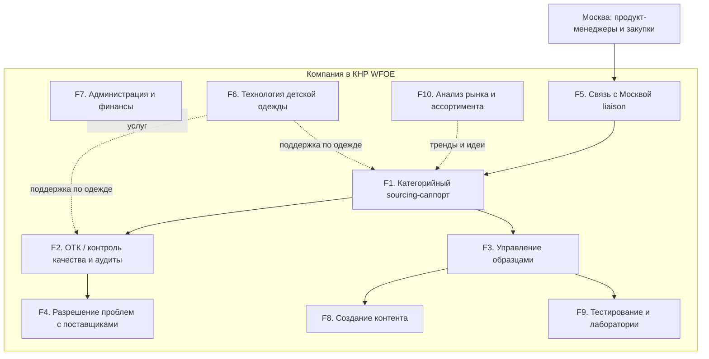
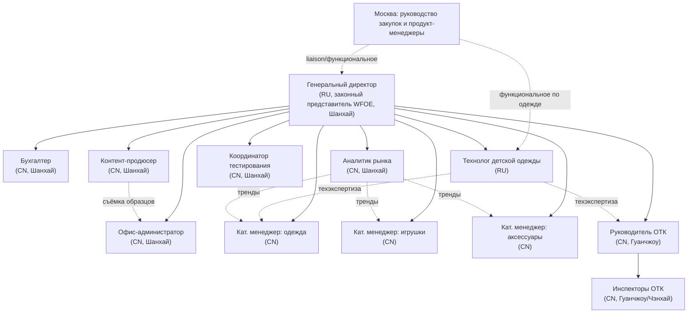
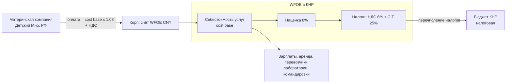
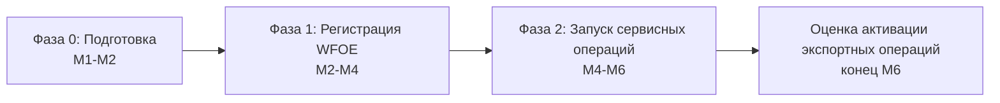
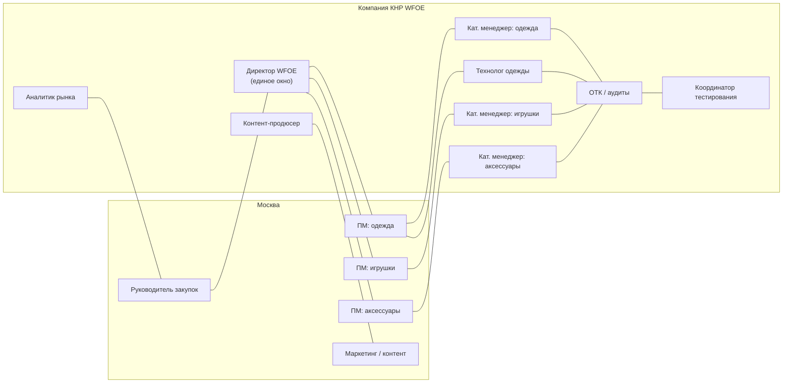
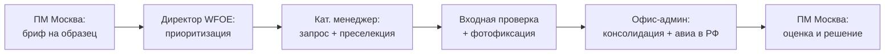
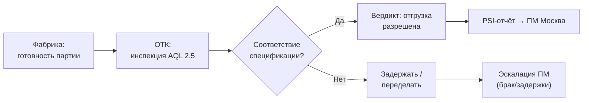
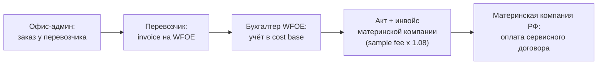

# Презентация — WFOE «Детский Мир» в КНР (Фаза 1, 6 месяцев)

> **Аудитория:** руководство закупочного блока «Детского Мира» (Москва), Finance, HR  
> **Горизонт:** M1–M6 — сервисный центр без торговли и экспорта  
> **Источник:** исследование в `office_setup/` (01–06)  
> **Спецификация для PPTX:** [build-spec.md](./build-spec.md) · [concept.md](./concept.md)

---

## Слайд 1. Титульный

**Сервисный центр закупок в Китае**  
**WFOE «Детский Мир»: структура, бюджет и план запуска на 6 месяцев**

*Фаза 1 — услуги для московских продукт-менеджеров и закупок · без торговли на собственный баланс*

*[дата] · [ФИО докладчика, роль]*

**Форма:** WFOE (торговая компания с правом экспорта) · HQ Шанхай · QC-узел Гуанчжоу

[Визуал: navy bar + crimson accent; карта КНР с точками Шанхай/Гуанчжоу — опционально]

---

## Слайд 2. Миссия и модель Фазы 1

# «Глаза и руки» компании в Китае

**Миссия:** обеспечить московскому офису прямой, контролируемый и быстрый доступ к китайским фабрикам — сорсинг, образцы, ОТК, контент, тестирование, аналитика, разрешение проблем с поставщиками.

**Ключевые принципы (Фаза 1):**

- Юридическая форма — **WFOE с правом экспорта**, но **6 месяцев — только сервисные услуги** по договорам с материнской компанией
- **Самофинансирование:** выручка = cost base × 1,08 (cost-plus) + НДС 6%
- **Русское управление + китайская операционная команда** — директор и технолог (RU), локальный штат (CN)
- Экспортная лицензия оформляется **«про запас»** — активация в **Фазе 2** (решение в конце M6)

**Заметки спикеру:** акцент — не представительство и не торговый дом «с первого дня», а контролируемый сервисный контур с прозрачным биллингом.

---

## Слайд 3. Scope Фазы 1: что делаем и чего не делаем

<!-- table_id: scope-in-out | layout: two_column_bullets -->

### В scope (6 месяцев)

| Направление | Содержание |
|---|---|
| Sourcing-саппорт | Поиск и верификация фабрик, AVL, КП по брифам ПМ |
| Образцы | Преселекция, консолидация, авиа-отправка в РФ (3–7 дней) |
| ОТК и аудиты | Pre-shipment AQL 2,5, аудиты фабрик/складов/логистики |
| Брак и задержки | Выезды на фабрику, CAPA, эскалация в Москву |
| Контент, тесты, аналитика | Фото/видео, лаборатории SGS/BV-класс, тренды рынка |
| Liaison + финансы | Единое окно для ПМ, биллинг услуг материнской компании |

### Out of scope (Фаза 1)

| Исключено | Комментарий |
|---|---|
| Экспорт и торговля на баланс WFOE | Лицензия есть, не используется |
| Контракты на закупку/импорт товара | Ведёт головная компания РФ |
| Прямые платежи фабрикам за товар | Исключение — pass-through лабораторий (F9) |
| Складирование и таможня товарных партий | Функция логистики РФ |
| B2C / маркетплейсы в КНР | — |

> Фаза 2 (конец M6): go/no-go по активации торговых/экспортных операций **без смены юр. формы**.

---

## Слайд 4. Карта функциональных блоков

<!-- diagram_id: func-blocks | file: diagram-01-func-blocks.mmd | layout: diagram_right -->

**Легенда (10 блоков):**

- **F1–F5** — основная операционная цепочка (sourcing → QC → образцы → проблемы → liaison)
- **F6** — технология детской одежды (tech pack, PPS, GB 31701)
- **F8–F10** — контент, лаборатории, аналитика рынка
- **F7** — администрация, учёт WFOE, **биллинг услуг** материнской компании

---

## Слайд 5. Операционная цепочка F1–F5 и KPI

<!-- table_id: functions-summary | layout: table_full -->

| Функция | Цель | KPI (целевые) |
|---|---|---|
| **F1. Sourcing** | Поддержка ПМ: фабрики, AVL, КП | Ответ ПМ ≤ 2 раб. дня; ≥ 90% брифов в срок |
| **F2. ОТК / QC** | Pre-shipment + аудиты до отгрузки | Дефектность отгрузок **< 1,5%**; PSI ≤ 1 день |
| **F3. Образцы** | Преселекция и отправка в РФ | **3–7 дней** «фабрика → отправка»; ≥ 98% корректных отправок |
| **F4. Брак/задержки** | Выезд, root cause, CAPA | Выезд ≤ **3 раб. дня**; ≥ 80% кейсов без эскалации в РФ |
| **F5. Liaison** | Единое окно для Москвы | Ответ ≤ 1 раб. день; еженедельный статус без срывов |

**Дополнительные функции (M5+):** F6 tech pack/PPS · F8 контент к старту продаж · F9 тесты ТР ТС/GB · F10 тренды и «волны спроса» в Азии.

---

## Слайд 6. Организационная структура

<!-- diagram_id: org-structure | file: diagram-02-org-structure.mmd | layout: diagram_full -->

**Сплошные линии** — административное подчинение директору · **Пунктир** — функциональные связи с Москвой и внутри команды.

---

## Слайд 7. Численность и локации (к концу M6)

<!-- table_id: team-locations | layout: table_compact -->

| Локация | Роли | Чел. |
|---|---|---:|
| **Шанхай (HQ)** | Директор (RU), технолог (RU), бухгалтер, офис-админ, 3 кат. менеджера, контент, тестирование, аналитик | **10** |
| **Гуанчжоу (QC-узел)** | Руководитель ОТК + инспекторы (1–2) | **2–3** |
| **Итого** | | **12–13** |

**Модель найма:** RU — директор (Z-виза, legal representative), технолог; CN — все операционные роли (переговоры с фабриками, GB-стандарты, гуанси, лаборатории).

> Категорийные менеджеры и технолог базируются в Шанхае, но проводят значительную часть времени в командировках (Гуандун, Фуцзянь, Чжэцзян, Чэнхай).

---

## Слайд 8. Бюджет первых 6 месяцев — сводка

<!-- table_id: budget-summary | layout: table_full -->

*Курс-ориентир: **1 CNY = 12 RUB** · модель: cost-plus 8%*

| Блок | CNY | RUB (×12) |
|---|---:|---:|
| **CAPEX (единовременно, старт)** | **254 000** | **3 048 000** |
| **Себестоимость услуг — cost base (6 мес.)** | **1 730 675** | **20 768 100** |
| **Налоги WFOE (НДС 6% + CIT 25% на наценку)** | **146 761** | **1 761 132** |
| **Выручка по сервисным договорам (без НДС)** | **1 869 129** | **22 429 548** |

**Run-rate на M6:** cost base **433 025 CNY/мес** (~5,2 млн CNY/год · ~62,4 млн RUB/год).

**Денежный отток материнской компании (6 мес.):** выручка + НДС = **1 981 277 CNY** (~23,78 млн RUB).

> CAPEX концентрируется в M1–M2; в первые месяцы выручка не покрывает CAPEX — нужна инъекция оборотного капитала (~3-месячный cost base в резерве).

---

## Слайд 9. Финансовая модель: сервисные договоры (cost-plus)

<!-- diagram_id: budget-flow | file: diagram-03-budget-flow.mmd | layout: diagram_full -->

**Принцип:** WFOE не получает «дотацию», а **продаёт услуги** материнской компании. Наценка 8% — ориентир для трансфертного ценообразования (согласовать с налоговым консультантом).

**Практика:** один **рамочный сервисный договор** + приложения-SOW по услугам + **ежемесячные акты**.

---

## Слайд 10. Перечень сервисных договоров

<!-- table_id: service-contracts | layout: table_full -->

| Услуга (billable) | Функция | Модель оплаты |
|---|---|---|
| Поиск и верификация поставщиков (sourcing fee) | F1 | Ежемесячный ретейнер / за бриф |
| Контроль качества и аудиты (QC / audit fee) | F2, F4 | За инспекцию/аудит + ретейнер |
| Управление и отправка образцов (sample fee) | F3 | За партию / ретейнер |
| Создание контента (content production fee) | F8 | За SKU / пакет |
| Координация тестирования (lab testing fee) | F9 | Координация + **pass-through** счетов лабораторий |
| Аналитика рынка (market intelligence retainer) | F10 | Ежемесячный ретейнер |
| Управление и liaison (management fee) | F5, F7 | Ежемесячный ретейнер |

> Счета лабораторий SGS/BV/Intertek — **pass-through**: перевыставляются материнской компании отдельной строкой, в cost base не входят.

---

## Слайд 11. Roadmap запуска M1–M6

<!-- diagram_id: roadmap-phases | file: diagram-04-roadmap-phases.mmd | layout: diagram_top -->
<!-- table_id: roadmap-months | layout: table_below_diagram -->

| Месяц | Ключевые действия | Веха |
|---|---|---|
| **M1** | Директор, юрконсультант, ТМ в CNIPA, сервисные договоры (проработка) | Scope утверждён |
| **M2** | Pre-approval WFOE, офис-админ, кат. менеджер (игрушки), рамочный договор | Команда 3 чел. |
| **M3** | Business license, счёт, экспортная рег. «про запас», ОТК-протокол AQL 2,5 | WFOE действует, 6 чел. |
| **M4** | Бухгалтер, инспектор, аналитик; **первые образцы и PSI**; первый биллинг | 9 чел., первый акт |
| **M5** | Технолог, контент, тестирование, 2-й инспектор; PPS, контент, тесты | **13 чел., полная команда** |
| **M6** | Штатный режим, KPI, ретроспектива, **go/no-go экспорт (Фаза 2)** | KPI на уровне |

---

## Слайд 12. Вехи, KPI и график найма

<!-- table_id: milestones | layout: table_compact -->
<!-- table_id: kpi-phases | layout: table_right_or_below -->
<!-- table_id: hiring-ramp | layout: table_compact -->

### Ключевые вехи (13)

| # | Веха | Срок |
|---|---|---|
| 1 | Scope/бюджет утверждены, директор нанят | M1 |
| 2 | ТМ поданы в CNIPA | M1 |
| 3 | Название WFOE, офис, сервисный договор | M2 |
| 4 | Business license + печати | M3 |
| 5 | Счёт, налоговая регистрация | M3 |
| 6 | Экспортная регистрация «про запас» | M3 |
| 7 | Протокол ОТК утверждён | M3 |
| 8 | Первые образцы + первый биллинг | M4 |
| 9 | Первые PSI и аудиты | M4 |
| 10 | Технолог / контент / тестирование | M5 |
| 11 | Полная команда (13 чел.) | M5 |
| 12 | KPI на целевом уровне | M6 |
| 13 | Go/No-Go материалы по экспорту | M6 |

### KPI по фазам

| KPI | M1–M2 | M3–M4 | M5–M6 |
|---|---|---|---|
| Численность | 1→3 | 6→9 | 13 |
| Верифицированных фабрик (накопит.) | 0 | 10–15 | 25–40 |
| Образцы в РФ | 0 | первые | регулярный поток |
| PSI / аудиты в мес. | 0 | первые | по приоритетным SKU |
| Дефектность отгрузок | — | базлайн | **< 1,5%** |
| SLA ответа ПМ | — | ≤ 2 дня | **≤ 1 день** |

### График найма (● = в штате)

| Роль | M1 | M2 | M3 | M4 | M5 | M6 |
|---|:---:|:---:|:---:|:---:|:---:|:---:|
| Директор (RU) | ● | ● | ● | ● | ● | ● |
| Офис-админ (CN) | | ● | ● | ● | ● | ● |
| Кат. менеджер — игрушки | | ● | ● | ● | ● | ● |
| Кат. менеджеры — одежда/акс. | | | ● | ● | ● | ● |
| Руководитель ОТК | | | ● | ● | ● | ● |
| Бухгалтер, инспектор, аналитик | | | | ● | ● | ● |
| Технолог, контент, тестир., инсп. №2 | | | | | ● | ● |
| **Активных сотрудников** | **1** | **3** | **6** | **9** | **13** | **13** |

---

## Слайд 13. Горизонтальные связи с московским офисом

<!-- diagram_id: moscow-links | file: diagram-05-moscow-links.mmd | layout: diagram_full -->

**Принципы:**

- **Единое окно:** все запросы через директора WFOE (F5) — без «дёргания» исполнителей в обход приоритетов
- **Функциональные связки:** кат. менеджеры ↔ профильные ПМ; технолог ↔ ПМ одежды; контент ↔ маркетинг
- **Общий трекер:** задачи, AVL, библиотека образцов, протоколы тестов — доступны обеим сторонам
- **Часовые пояса:** МСК +5 ч (зима); рабочее окно ~11:00–18:00 МСК

---

## Слайд 14. Сквозные процессы: образцы, QC и оплата доставки

<!-- diagram_id: process-samples | layout: two_column_left -->
<!-- diagram_id: process-qc | layout: two_column_right -->
<!-- diagram_id: sample-payment | layout: diagram_bottom -->

### Процесс А. Образцы (3–7 дней «фабрика → РФ»)

### Процесс Б. Pre-shipment QC (AQL 2,5)

### Контур оплаты доставки образцов (cost-plus)

> WFOE оплачивает перевозчика из своих средств → расход в cost base → **перевыставление** материнской компании с наценкой 8% + НДС.

---

## Слайд 15. SLA, риски, Фаза 2 и следующие шаги

<!-- table_id: sla | layout: table_two_col -->
<!-- table_id: phase2-criteria | layout: checklist -->

### SLA (ключевые)

| Параметр | Значение |
|---|---|
| Первичный ответ на запрос ПМ | ≤ 1 раб. день |
| Закрытие брифа на образец | 3–7 дней |
| Выезд на фабрику по браку | ≤ 3 раб. дня |
| PSI-отчёт после инспекции | ≤ 1 раб. день |
| Биллинг материнской компании | ежемесячно (акт + инвойс) |
| Еженедельный статус-отчёт | без срывов |
| Аналитические обзоры | раз в 2 недели |

### Риски запуска (топ-5)

| Риск | Митигация |
|---|---|
| Задержка Z-визы директора | Старт оформления M1, HR-агентство |
| Срыв регистрации WFOE | Внешний юрконсультант, буфер в сроках |
| TP / трансфертное ценообразование | Согласовать cost-plus с консультантом M1–M2 |
| Кража ИС | ТМ в CNIPA **до** визитов на фабрики, NDA |
| Открытие счёта (санкции) | Bank of China / ICBC, CNY, due diligence заранее |

### Критерии активации Фазы 2 (конец M6)

- [ ] KPI сервисных функций на целевом уровне, биллинг отлажен
- [ ] Подтверждённая экономия на закупках (Finance/Procurement)
- [ ] Бизнес-кейс под торговые операции WFOE (консолидация, B2B)
- [ ] Готовность Finance к товарным CNY-расчётам
- [ ] Положительная оценка санкционного/правового риска

---

## Заключение (финальный тезис на слайде 15)

**WFOE в Фазе 1 — это контролируемый сервисный контур «глаза и руки» в Китае с прозрачным финансированием через cost-plus, а не торговый риск с первого дня.**

**Следующие шаги для руководства:**

1. Утвердить scope, бюджет и оргструктуру (M1)
2. Назначить куратора со стороны закупок Москвы для liaison
3. Запустить найм директора и оформление WFOE
4. Согласовать рамочный сервисный договор и TP-документацию

---

## Примечания для докладчика (не на слайдах)

- **Общее время:** 20–25 мин + вопросы. Слайды 8–10 (бюджет) — ~4 мин, не уходить в детали помесячного OPEX (есть Excel).
- **Слайд 3:** чётко разделить «лицензия есть» vs «не используем» — типичный вопрос Finance.
- **Слайд 9–10:** если спросят про TP — «наценка 8% согласуется с консультантом, документируется до первого биллинга».
- **Слайд 12:** поэтапный найм — осознанное снижение burn rate первых месяцев.
- **Слайд 14:** sample fee — не «экспорт товара», а сервис + pass-through логистики.
- **Слайд 15:** go/no-go — не «обязательно торгуем», а **опция** при выполнении критериев; юр. форма уже готова.
- **Excel:** детализация — [Бюджет_представительство_КНР_6мес.xlsx](../Бюджет_представительство_КНР_6мес.xlsx), регенерация — `build_budget_xlsx.py`.

---

**Файл подготовлен на основе исследования office_setup (01–06).**  
**Спецификация сборки PPTX:** [build-spec.md](./build-spec.md)
