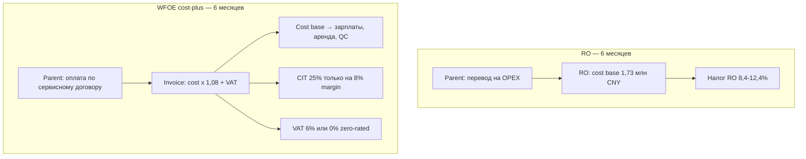
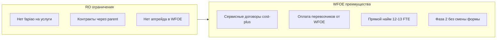

# WFOE vs RO: налоги и модель Фазы 1 — аналитический отчёт

> **Назначение:** обоснование выбора **WFOE (сервисный cost-plus)** вместо **Representative Office (RO)** для «Детского Мира» в КНР на горизонте первых 6 месяцев **без торговой деятельности**.  
> **Ответ на вопрос №1:** [director-interview-questions.md](./director-interview-questions.md)  
> **Модель:** [03_budget_6m.md](../03_budget_6m.md), [01_functional_structure.md](../01_functional_structure.md)  
> **Disclaimer:** аналитический документ, **не юридическое или налоговое заключение**. Финальные ставки, zero-rating НДС и наценка cost-plus должны быть подтверждены локальным TP/налоговым консультантом (Шанхай).

---

## 1. Резюме для руководства

**Вывод:** WFOE в режиме **сервисного центра (cost-plus 8%)** — **более выгодная и правомерная форма** для описанной модели Фазы 1, чем RO или работа только через агента — **даже если компания не ведёт торговлю и экспорт**.

| Критерий | RO | WFOE cost-plus (Фаза 1) |
|---|---|---|
| Налоговая нагрузка (6 мес., cost base 1,73 млн CNY) | **~8,4–12,4%** от расходов | **~8,5%** (база) или **~2,0%** (при zero-rating НДС) |
| Сервисные договоры и fapiao parent | ❌ | ✅ |
| Оплата перевозчиков/лабораторий от имени КНР | Ограничено / через parent | ✅ |
| Прямой найм 12–13 FTE | Частично (dispatch в ряде городов) | ✅ |
| Активация Фазы 2 (торговля/экспорт) | Закрытие RO + новая WFOE | ✅ без смены формы |
| Соответствие 10 функциям F1–F10 | «Серая зона» liaison | ✅ в business scope |

**Ключевой налоговый аргумент:** RO облагается по **deemed profit method** на **весь объём расходов** (совокупная нагрузка 8,4–12,4%). WFOE платит **CIT 25% только на наценку 8%** (не на весь cost base) плюс НДС 6% на услуги; при оформлении **export VAT zero-rating** на услуги parent совокупная нагрузка падает до **~2% от cost base** — существенно ниже RO.

**Ключевой операционный аргумент:** модель [06_sample_delivery_scheme_payment.md](../06_sample_delivery_scheme_payment.md) (sample fee, оплата перевозчика, cost-plus биллинг) **юридически не реализуема в полном объёме через RO**; WFOE — стандартная структура для cost-plus service centres в КНР (MSA, Acclime, PwC).

> **Примечание к раннему исследованию:** в [04_block4_regulatory_legal_framework.md](../../04_block4_regulatory_legal_framework.md) рекомендовался старт с RO. Текущий пакет `office_setup/` **обновляет** рекомендацию: WFOE с сервисным scope и без торговли в M1–M6.

---

## 2. Сравниваемые формы присутствия

| Критерий | RO (代表机构) | WFOE service/cost-plus | Агент / трейдер |
|---|---|---|---|
| **Правосубъектность** | Нет (отделение parent) | Полная (ООО) | Контрагент third party |
| **Коммерческая выручка** | ❌ Запрещена | ✅ По сервисным договорам | ✅ |
| **Fapiao (счёт-фактура) parent** | ❌ | ✅ 6% VAT (или zero-rated) | Через агента |
| **Контракты с фабриками/перевозчиками** | Только от parent | ✅ От WFOE | От агента |
| **Sourcing + QC + образцы** | Liaison (ограничено) | ✅ В business scope | Частично |
| **Pass-through лабораторий** | Слабая документальная база | ✅ Отдельная строка акта | Зависит от агента |
| **Прямой найм** | Ограничения (dispatch) | ✅ 12–13 FTE | N/A |
| **Срок регистрации** | 6–10 нед. | 2–4 мес. | N/A |
| **CAPEX setup (ориентир)** | ~40–80 тыс. CNY | **254 тыс. CNY** (6 мес.) | 0 |
| **Переход к торговле (Фаза 2)** | Закрытие + новая WFOE | Активация scope | Новый контракт |

**Нормативная база RO:** Приказ Госсовета №584 (регламент RO); разрешены liaison, market research, координация закупок, **QC oversight** — но **не** коммерческая деятельность, выставление счетов, подписание контрактов от своего имени (MSA, China Briefing, FDI China).

**Нормативная база WFOE:** Company Law PRC (2024); Foreign Investment Law; business scope «consulting / technical services / trade support»; сервисные договоры с related party — стандарт TP-практики (Guo Shui Fa [2010] №18 для RO; для WFOE — CIT Law + STA TP rules).

---

## 3. Налогообложение Representative Office (RO)

### 3.1. Принцип

RO **не может** получать выручку от коммерческой деятельности. Операционные расходы финансируются **переводами от материнской компании** (cost centre). Налоговая база определяется по **Guo Shui Fa [2010] №18** («Временные меры по налогообложению RO иностранных предприятий»).

### 3.2. Методы расчёта (Circular 18)

| Метод | Когда применяется |
|---|---|
| **Actual amount** | Полный учёт доходов и расходов |
| **Revenue-based (deemed)** | Есть выручка, нет точных расходов |
| **Expense-based (deemed)** | Есть расходы, нет точной выручки — **типично для RO sourcing/QC** |

**Expense-based формулы** (deemed profit rate **не менее 15%** с 2010 г., ранее 10%):

```
Deemed Revenue = Total Expenses / (1 − Deemed Profit Rate)
Taxable Income = Deemed Revenue × Deemed Profit Rate
CIT Payable    = Taxable Income × 25%
```

**Пример** при cost base **1 730 675 CNY** и deemed rate **15%**:

| Шаг | Расчёт | CNY |
|---|---|---:|
| Deemed Revenue | 1 730 675 / 0,85 | 2 036 676 |
| Taxable Income | 2 036 676 × 15% | 305 501 |
| CIT (25%) | 305 501 × 25% | **76 375** |

Это **только CIT**. С учётом VAT и surcharges (после реформы BT→VAT, 2016) практики указывают **совокупную** нагрузку на расходы:

| Режим RO | Совокупная нагрузка на expenses | Источник |
|---|---|---|
| Малый масштаб (≤5 млн CNY revenue) | **~8,4%** | RSM Stone Forest |
| General VAT taxpayer | **≤12,39%** | RSM Stone Forest |
| Упрощённая оценка в раннем исследовании DM | **~10–11,75%** | [04_block4](../../04_block4_regulatory_legal_framework.md), China Briefing |

### 3.3. Денежный поток parent при RO (6 месяцев)

База расходов RO = **тот же cost base 1 730 675 CNY**, что и у WFOE (сопоставимый штат и OPEX).

| Сценарий RO | Налог RO | **Итого отток parent (опер.)** | Эфф. ставка |
|---|---:|---:|---:|
| Нижняя граница (8,4%) | 145 377 | **1 876 052** | 8,4% |
| Верхняя граница (12,39%) | 214 431 | **1 945 106** | 12,4% |
| Только CIT по формуле 15%×25% | 76 375 | *+ VAT/surtax сверх* | ~4,4% CIT only |

> RO **не выставляет** parent структурированный сервисный инвойс; переводы + налог RO — отдельные потоки. TP-прозрачность для группы **ниже**, чем у cost-plus WFOE.

### 3.4. Ограничения RO для модели «Детский Мир»

1. **Sample fee / QC fee** — в RO нет легального механизма «продажи услуг» parent; логистика образцов ([06_sample_delivery_scheme_payment.md](../06_sample_delivery_scheme_payment.md)) оформляется хуже, чем invoice WFOE → parent.
2. **RO нельзя преобразовать в WFOE** — только ликвидация RO и параллельная регистрация WFOE (Acclime, China Briefing) → **дублирование затрат** при Фазе 2.
3. **Найм:** в ряде локаций RO historically использовал dispatch agencies; WFOE — прямой employment contract (важно для удержания ОТК и кат. менеджеров).
4. **Масштаб 10 функций (F1–F10)** — RO формально «liaison»; объём sourcing, контента, лабораторий, аналитики **ближе к коммерческому сервису**, что повышает **налоговый и регуляторный риск** при проверке.

---

## 4. Налогообложение WFOE (сервисный cost-plus, без торговли)

### 4.1. Модель «Детского Мира» (Фаза 1)

Описана в [03_budget_6m.md](../03_budget_6m.md), §7 и [01_functional_structure.md](../01_functional_structure.md):

- WFOE оказывает **набор услуг** материнской компании (sourcing, QC, образцы, контент, тестирование, аналитика, management).
- Цена = **cost base × (1 + 8%)** — стандарт **cost-plus / 成本加成** для внутригрупповых услуг.
- **Торговля и экспорт товара не ведутся**; экспортная лицензия — «про запас» для Фазы 2.

### 4.2. Налоги WFOE

| Налог | База | Ставка | 6 мес. (CNY) |
|---|---|---|---:|
| **НДС (VAT)** | Выручка по договорам | **6%** (modern services) | 112 148 |
| **CIT** | Наценка 8% (не весь cost base!) | **25%** | 34 613 |
| **Итого налоги** | | | **146 761** |

**Ключевое отличие от RO:** CIT начисляется на **138 454 CNY** наценки, а не на **1 730 675 CNY** расходов.

```
Cost base (6 мес.)     = 1 730 675 CNY
Наценка 8%             =   138 454 CNY
Выручка (без НДС)      = 1 869 129 CNY
НДС 6%                 =   112 148 CNY
CIT 25% × наценка      =    34 613 CNY
Отток parent (услуги)  = 1 981 277 CNY  (= выручка + НДС)
```

### 4.3. Опция: zero-rating НДС на экспорт услуг

По **Caishui [2016] №36** (п. 4 приложения) и практике STA часть **cross-border services** parent может квалифицироваться как **VAT zero-rated** (0%), если:

- услуги фактически потребляются за рубежом;
- оформлен **intercompany service agreement**;
- зарегистрирован контракт export VAT / выполнены требования STA ([chinatax.gov.cn](https://www.chinatax.gov.cn/chinatax/c102449/c5239191/content.html)).

**Сценарий zero-rating (6 мес.):**

| Показатель | CNY |
|---|---:|
| Cost base | 1 730 675 |
| Выручка parent (без НДС) | 1 869 129 |
| НДС | **0** |
| CIT (25% × наценка) | 34 613 |
| **Отток parent** | **1 869 129** |
| **Эфф. налоговая нагрузка / cost base** | **2,0%** |

> Zero-rating **не автоматическая** — требует подачи и согласования в первом квартале работы WFOE. В бюджете заложен **консервативный** сценарий с НДС 6% ([03_budget_6m.md](../03_budget_6m.md), §9).

### 4.4. Transfer pricing

- Наценка **8%** — в рынке **5–15%** для routine support services (MSA Advisory, Acclime).
- Необходимы: **Master Service Agreement**, SOW по F1–F10, **benchmarking study**, contemporaneous TP documentation.
- Согласование с консультантом — **M1–M2** ([04_setup_development_plan_6m.md](../04_setup_development_plan_6m.md)).

---

## 5. Количественное сравнение (6 месяцев, одна операционная база)

**Единая база:** cost base **1 730 675 CNY** (идентичный штат/OPEX из [03_budget_6m.md](../03_budget_6m.md), §5–7).

| Сценарий | Налоги | Отток parent (опер.) | vs cost base | vs RO (8,4%) |
|---|---:|---:|---:|---|
| **WFOE, база (НДС 6%)** | 146 761 | 1 981 277 | 8,48% | +0,08 п.п. |
| **WFOE, zero-rating НДС** | 34 613 | 1 869 129 | **2,00%** | **−6,4 п.п.** |
| **RO, 8,4%** | 145 377 | 1 876 052 | 8,40% | — |
| **RO, 12,39%** | 214 431 | 1 945 106 | 12,39% | +4,0 п.п. |

**Интерпретация (честная):**

1. **Без zero-rating** совокупная налоговая нагрузка WFOE (**8,48%**) **сопоставима** с RO при **8,4%** — WFOE **не дороже** нижней границы RO и **дешевле** верхней (12,4%).
2. **С zero-rating** WFOE **существенно дешевле** любого сценария RO.
3. **Отток parent** у WFOE с НДС 6% **выше**, чем у RO на **~105 тыс. CNY** за 6 мес. — это **112 тыс. НДС**, который для foreign parent обычно **не зачитывается** (учитывается как cost); при zero-rating разница **исчезает**, WFOE становится **дешевле** RO на **~7 тыс. CNY** vs RO 8,4%.

### 5.1. CAPEX и горизонт 12–24 месяца

| Статья | RO (ориентир) | WFOE (бюджет DM) |
|---|---:|---:|
| Setup CAPEX (6 мес.) | ~40 000–80 000 CNY | **254 000 CNY** |
| Повторная регистрация при Фазе 2 | **+150 000–250 000 CNY** (новая WFOE) | **0** (активация scope) |
| Простой при переходе RO→WFOE | 2–4 мес. | — |

**Вывод:** более высокий CAPEX WFOE **окупается** отсутствием второй регистрации и простоя при переходе к торговле — особенно если Фаза 2 на горизонте M6–M18.

### 5.2. Сравнение денежных потоков



---

## 6. Неторговые преимущества WFOE для модели «Детский Мир»

Даже **без торговли** WFOE даёт преимущества, которых RO не обеспечивает:

| Функция / процесс | RO | WFOE |
|---|---|---|
| **F3. Образцы:** оплата перевозчика, sample fee | Parent или grey zone | [06_sample_delivery_scheme_payment.md](../06_sample_delivery_scheme_payment.md) |
| **F2. PSI / аудиты:** договор с инспекторами, fapiao | Ограничено | ✅ |
| **F9. Лаборатории:** pass-through SGS/BV | Сложнее | ✅ отдельная строка акта |
| **F7. Биллинг:** ежемесячные акты cost-plus | ❌ | ✅ [03_budget_6m.md](../03_budget_6m.md) §7 |
| **F5. Liaison + трекер** | ✅ | ✅ + юридически чистая структура |
| **12–13 FTE, Шанхай + Гуанчжоу** | Узкий scope | ✅ [02_org_structure.md](../02_org_structure.md) |
| **Фаза 2: экспорт/торговля** | Новая компания | Активация ([04_setup_development_plan_6m.md](../04_setup_development_plan_6m.md) §7) |



---

## 7. Сравнение с агентом (кратко)

| | Агент | WFOE DM |
|---|---|---|
| Setup cost | Низкий | 254k CAPEX + регистрация |
| Контроль QC / sourcing | Низкий | Полный |
| Конфликт интересов | Высокий | Нет |
| IP / NDA / AVL | Риск | CNIPA + контракты WFOE |
| Масштаб 10 функций | Не закрывает | ✅ |
| Налоги в КНР | На агенте | Прозрачный cost-plus |

Агент остаётся **вспомогательным** каналом (узкие категории), но **не заменяет** собственное presence для модели DM.

---

## 8. Риски WFOE и митигация

| Риск | Митигация (уже в плане DM) |
|---|---|
| TP-аудит, оспаривание 8% | Benchmarking + SOW, консультант M1–M2 |
| НДС не zero-rated | Бюджет с 6% НДС заложен ([03_budget_6m.md](../03_budget_6m.md)) |
| Дольше регистрация vs RO | Буфер M1–M2, внешний юрконсультант ([04_setup_development_plan_6m.md](../04_setup_development_plan_6m.md)) |
| Открытие счёта (санкции) | BoC / ICBC, CNY, due diligence |
| CAPEX выше RO | Экономия на RO→WFOE миграции + Фаза 2 |

---

## 9. Итоговый вывод

**WFOE (сервисный cost-plus, без торговли в Фазе 1) — более выгодная форма** для «Детского Мира», потому что:

1. **Налоги:** нагрузка **≤ RO** в базовом сценарии (8,5% vs 8,4–12,4%) и **значительно ниже RO** при zero-rating НДС (~2% vs 8,4%+).
2. **Право:** модель F1–F10, sample fee, QC fee и pass-through **соответствуют** WFOE; для RO — **структурные ограничения** и регуляторный риск при масштабировании.
3. **Финансы группы:** cost-plus даёт **прозрачный TP-контур** (акты, SOW, benchmarking) vs «тихие» переводы на RO.
4. **Стратегия:** **нет двойных затрат** ликвидация RO + WFOE при Фазе 2; экспортная лицензия уже в scope.
5. **Операции:** прямой найм, счёт, печати, контракты с перевозчиками и лабораториями — **необходимы** для KPI (образцы 3–7 дней, PSI ≤ 1 день, AVL 25–40 фабрик).

**Рекомендация для ответа на собеседовании (вопрос №1):**  
«Мы выбираем WFOE не ради торговли в первые 6 месяцев, а потому что **сервисный cost-plus WFOE** — стандартная, **налогово не хуже RO** (а при zero-rating — лучше) структура для sourcing/QC-центра с **полным legal capacity**, которую RO **не может** реplicировать без компромиссов; плюс мы **не платим дважды** за смену формы при Фазе 2.»

---

## 10. Источники

### Нормативные и официальные

- Guo Shui Fa [2010] №18 — налогообложение RO (deemed profit, min 15%)
- PRC Corporate Income Tax Law — ставка 25%
- Caishui [2016] №36 — VAT, в т.ч. modern services 6%, zero-rating cross-border services
- Приказ Госсовета №584 — виды деятельности RO
- [STA: zero-rating VAT on cross-border taxable services](https://www.chinatax.gov.cn/chinatax/c102449/c5239191/content.html)

### Профессиональные обзоры

- PwC Tax Summaries — People's Republic of China, CIT
- RSM Stone Forest — VAT regime impact on RO (8,4% / 12,39% on expenditures)
- China Briefing — RO vs WFOE, sourcing models
- MSA Advisory — Cost-plus WFOE, consulting WFOE (2026)
- Acclime — Setting up a Cost+ WFOE in China (tax comparison vs RO)
- Faegre Drinker — Circular 18 summary

### Внутренние документы «Детский Мир»

- [01_functional_structure.md](../01_functional_structure.md) — F1–F10, Фаза 1
- [03_budget_6m.md](../03_budget_6m.md) — cost-plus, налоги 146 761 CNY / 6 мес.
- [04_setup_development_plan_6m.md](../04_setup_development_plan_6m.md) — roadmap, TP M1–M2
- [06_sample_delivery_scheme_payment.md](../06_sample_delivery_scheme_payment.md) — sample fee
- [04_block4_regulatory_legal_framework.md](../../04_block4_regulatory_legal_framework.md) — исходное сравнение форм (RO recommendation superseded)

---

*Отчёт v1.0 · Июнь 2026 · Подготовлен для обоснования WFOE Фазы 1 «Детский Мир» КНР*
